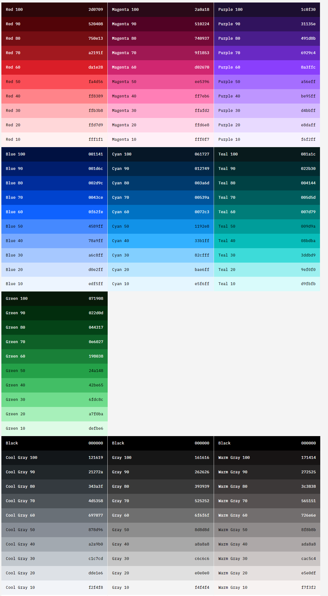

# Tasty Point

 

Carrera:
Ingeniería de Software

Nombre del curso:
Arquitectura de Software Emergentes

Sección:
WS82

Nombre del profesor:
Royer Edelwer Rojas Malasquez

"Informe de Trabajo Final"

Nombre del startup:
Tasty Point

Nombre del producto:
TastyPoint

Relación de integrantes:

- Marco Antoni Mendoza Rodriguez
- Claudia Lucia Rozas Gamero (U201922910)
- Andres Christian Reynoso (U202010196)
- David Antonio Torres Vilchez (U202010942)
- Adrian Marquina Vichino (U202017487)

Mes y año:
Setiembre 2023

Ciclo:
2023-2

## Registro de Versiones del Informe

| Version | Fecha| Autor | Descripción de la Modificación |
|-----------|-----------|-----------|-----------|
| 1.0 | 22/08/2023 | Andres Christian Reynoso | Se agrego el contenido relacionado al primer entregable TB1 |
| 2.0 | 7/09/2023 | David Torres Vilchez | Se agrego el contenido relacionado al primer entregable TB1 |
| 3.0 | 8/09/2023 | Claudia Rozas | Avance del capítulo 4 para el entregable TB1 |
| 3.0 | 9/09/2023 | Marco Mendoza | Avance del capítulo 4 para el entregable TB1 y correcciones en la documentación |
| 4.0 | 9/09/2023 | Adrian Marquina | Puntos faltantes de la TB1 (startup, link en los indices, styles) |
| 5.0 | 23/09/2023 | Claudia Rozas | Avance del capítulo 5 para la elaboración del TP |
| 6.0 | 25/09/2023 | Andres Reynoso | Avance del capítulo 6 para la elaboración del TP |
| 7.0 | 26/09/2023 | Adrian Marquina | Puntos faltantes del TP (landing page wireframes, landing page, style guidelines, indices, outcomes, formateo y estilos) |

## Project Report Collaboration Insights

**Enlace del Project Report: [https://github.com/Arquitectura-Software-2023/Project-Report.git](https://github.com/Arquitectura-Software-2023/Project-Report.git)**

## Contenido

- [Tabla de contenidos](#contenido)

- [Capítulo I: Introducción](#capítulo-i-introducción)
  - [1.1. Startup Profile](#11-startup-profile)
    - [1.1.1. Descripción de la Startup](#111-descripción-de-la-startup)
    - [1.1.2. Perfiles de integrantes del equipo](#112-perfiles-de-integrantes-del-equipo)
  - [1.2. Solution Profile](#12-solution-profile)
    - [1.2.1. Antecedentes y problemática](#121-antecedentes-y-problemática)
    - [1.2.2. Lean UX Process](#122-lean-ux-process)
      - [1.2.2.1. Lean UX Problem Statements](#1221-lean-ux-problem-statements)
      - [1.2.2.2. Lean UX Assumptions](#1222-lean-ux-assumptions)
      - [1.2.2.3. Lean UX Hypothesis Statements](#1223-lean-ux-hypothesis-statements)
      - [1.2.2.4. Lean UX Canvas](#1224-lean-ux-canvas)
  - [1.3. Segmentos objetivo](#13-segmentos-objetivo)

- [Capítulo II: Requirements Elicitation & Analysis](#capítulo-ii-requirements-elicitation--analysis)
  - [2.1. Competidores](#21-competidores)
    - [2.1.1. Análisis competitivo](#211-análisis-competitivo)
    - [2.1.2. Estrategias y tácticas frente a competidores](#212-estrategias-y-tácticas-frente-a-competidores)
  - [2.2. Entrevistas](#22-entrevistas)
    - [2.2.1. Diseño de entrevistas](#221-diseño-de-entrevistas)
    - [2.2.2. Registro de entrevistas](#222-registro-de-entrevistas)
    - [2.2.3. Análisis de entrevistas](#223-análisis-de-entrevistas)
  - [2.3. Needfinding](#23-needfinding)
    - [2.3.1. User Personas](#231-user-personas)
    - [2.3.2. User Task Matrix](#232-user-task-matrix)
    - [2.3.3. Empathy Mapping](#233-empathy-mapping)
    - [2.3.4. As-is Scenario Mapping](#234-as-is-scenario-mapping)

- [Capítulo III: Requirements Specification](#capítulo-iii-requirements-specification)
  - [3.1. To-Be Scenario Mapping](#31-to-be-scenario-mapping)
  - [3.2. User Stories](#32-user-stories)
  - [3.3. Impact Mapping](#33-impact-mapping)
  - [3.4. Product Backlog](#34-product-backlog)

- [Capítulo IV: Strategic-Level Software Design](#capítulo-iv-solution-software-design)
  - [4.1. Strategic-Level Attribute-Driven Design](#41-strategic-level-attribute-driven-design)
    - [4.1.1. Design Purpose](#411-design-purpose)
    - [4.1.2. Attribute-Driven Design Inputs](#412-attribute-driven-design-inputs)
      - [4.1.2.1. Primary Functionality (Primary User Stories)](#4121-primary-functionality-primary-user-stories)
      - [4.1.2.2. Quality attribute Scenarios](#4122-quality-attribute-scenarios)
      - [4.1.2.3. Constraints](#4123-constraints)
    - [4.1.3. Architectural Drivers Backlog. 6/40 V1.0](#413-architectural-drivers-backlog-640-v10)
    - [4.1.4. Architectural Design Decisions](#414-architectural-design-decisions)
    - [4.1.5. Quality Attribute Scenario Refinements](#415-quality-attribute-scenario-refinements)
  - [4.2. Strategic-Level Domain-Driven Design](#42-strategic-level-domain-driven-design)
    - [4.2.1. EventStorming](#421-eventstorming)
    - [4.2.2. Candidate Context Discovery](#422-candidate-context-discovery)
    - [4.2.3. Domain Message Flows Modeling](#423-domain-message-flows-modeling)
    - [4.2.4. Bounded Context Canvases](#424-bounded-context-canvases)
    - [4.2.5. Context Mapping](#425-context-mapping)
  - [4.3. Software Architecture](#43-software-architecture)
    - [4.3.1. Software Architecture System Landscape Diagram](#431-software-architecture-system-landscape-diagram)
    - [4.3.2. Software Architecture Context Level Diagrams](#432-software-architecture-context-level-diagrams)
    - [4.3.3. Software Architecture Deployment Diagrams](#433-software-architecture-container-level-diagrams)

- [Capítulo V: Tactical-Level Software Design](#capítulo-v-tactical-level-software-design)
  - [5.1 Bounded Context: Monitoring Context](#51-bounded-context-monitoring-context)
    - [5.1.1 Domain Layer](#511-domain-layer)
    - [5.1.2. Interface Layer](#512-interface-layer)
    - [5.1.3 Application Layer](#513-application-layer)
    - [5.1.4 Infrastructure Layer](#514-infrastructure-layer)
    - [5.1.5 Bounded  Context  Software Architecture Component Level Diagrams](#515-bounded-context-software-architecture-component-level-diagrams)
    - [5.1.6 Bounded Context Software Architecture code Level Diagrams](#516-bounded-context-software-architecture-code-level-diagrams)
      - [5.1.6.1 Bounded Context Domain Level Class Diagram](#5161-bounded-context-domain-level-class-diagram)
      - [5.1.6.2 Bounded Context Database Design Diagram](#5162-bounded-context-database-design-diagram)
  - [5.2 Bounded Context: Booking Context](#52-bounded-context-booking-context)
    - [5.2.1 Domain Layer](#521-domain-layer)
    - [5.2.2. Interface Layer](#522-interface-layer)
    - [5.2.3 Application Layer](#523-application-layer)
    - [5.2.4 Infrastructure Layer](#524-infrastructure-layer)
    - [5.2.5 Bounded  Context  Software Architecture Component Level Diagrams](#525-bounded-context-software-architecture-component-level-diagrams)
    - [5.2.6 Bounded Context Software Architecture code Level Diagrams](#526-bounded-context-software-architecture-code-level-diagrams)
      - [5.2.6.1 Bounded Context Domain Level Class Diagram](#5261-bounded-context-domain-level-class-diagram)
      - [5.2.6.2 Bounded Context Database  Design Diagram](#5262-bounded-context-database-design-diagram)
  - [5.3 Bounded Context: Stock Inventory Context](#53-bounded-context-stock-inventory-context)
    - [5.3.1 Domain Layer](#531-domain-layer)
    - [5.3.2. Interface Layer](#532-interface-layer)
    - [5.3.3 Application Layer](#533-application-layer)
    - [5.3.4 Infrastructure Layer](#534-infrastructure-layer)
    - [5.3.5 Bounded  Context  Software Architecture Component Level Diagrams](#535-bounded-context-software-architecture-code-level-diagrams)
    - [5.3.6 Bounded Context Software Architecture code Level Diagrams](#536-bounded-context-software-architecture-code-level-diagrams)
      - [5.3.6.1 Bounded Context Domain Level Class Diagram](#5361-bounded-context-domain-level-class-diagram)
      - [5.3.6.2 Bounded Context Database  Design Diagram](#5362-bounded-context-database-design-diagram)
  - [5.4 Bounded Context: Purchase Context](#54-bounded-context-purchase-context)
    - [5.4.1 Domain Layer](#541-domain-layer)
    - [5.4.2. Interface Layer](#542-interface-layer)
    - [5.4.3 Application Layer](#543-application-layer)
    - [5.4.4 Infrastructure Layer](#544-infrastructure-layer)
    - [5.4.5 Bounded  Context  Software Architecture Component Level Diagrams](#545-bounded-context-software-architecture-code-level-diagrams)
    - [5.4.6 Bounded Context Software Architecture code Level Diagrams](#546-bounded-context-software-architecture-code-level-diagrams)
      - [5.4.6.1 Bounded Context Domain Level Class Diagram](#5461-bounded-context-domain-level-class-diagram)
      - [5.4.6.2 Bounded Context Database  Design Diagram](#5462-bounded-context-database-design-diagram)
      - [5.4.6.3 General Domain Level Class Diagram](#5463-general-domain-level-class-diagram)
      - [5.4.6.4 General Database Design Diagram](#5464-general-database-design-diagram)
  - [Capítulo VI: Solution UX Design](#capítulo-vi-solution-ux-design)
    - [6.1. Style Guidelines](#61-style-guidelines)
      - [6.1.1. General Style Guidelines](#611-general-style-guidelines)
      - [6.1.2. Web & Mobile Style Guidelines](#612-web--mobile-style-guidelines)
    - [6.2. Arquitectura de la Información](#62-arquitectura-de-la-información)
      - [6.2.1. Sistemas de Organización](#621-sistemas-de-organización)
      - [6.2.2. Sistemas de Etiquetado](#622-sistemas-de-etiquetado)
      - [6.2.3. Etiquetas SEO y Metaetiquetas](#623-etiquetas-seo-y-metaetiquetas)
      - [6.2.4. Sistemas de Búsqueda](#624-sistemas-de-búsqueda)
      - [6.2.5. Sistemas de Navegación](#625-sistemas-de-navegación)
    - [6.3. Landing Page UI Design](#63-landing-page-ui-design)
      - [6.3.1. Landing Page Wireframe](#631-landing-page-wireframe)
      - [6.3.2. Landing Page Mock-up](#632-landing-page-mock-up)
    - [6.4. Applications UX/UI Design](#64-applications-uxui-design)
      - [6.4.1. Applications Wireframes](#641-applications-wireframes)
      - [6.4.2. Applications Wireflow Diagrams](#642-applications-wireflow-diagrams)

# Student Outcome

- **TB1**

|  Criterio específico | Participa en equipos multidisciplinarios con eficacia, eficiencia y objetividad, en el marco de un proyecto en soluciones de ingeniería de software | Conoce al menos un sector empresarial o dominio de aplicación de soluciones de software | Conocimientos de nuevos métodos de colaboración y comunicación |
|-----------|-----------|-----------|-----------|
| Andres Christian Reynoso | **Acciones:** Para este entregable hemos hecho coordinaciones en equipo para poder desarrollar los puntos relacionados a la TB1 **Conclusiones:** Gracias a esto pudimos desarrollar con mas velocidad este entregable. |  **Acciones:** El conocer a nuestros segmentos objetivos con el desarrollo delos UX es un paso fundamental para desarrollar el proyecto. **Conclusiones:** De esta forma, pudimos ponernos mejor en los zapatos de nuestros usuarios. |  **Acciones:** Los repositorios de github, al igual que las reuniones de discord ayudaron a fomentar comunicacion entre los miembros del equipo. **Conclusiones:** La comunicacion entre el equipo es fundamental para los avances del proyecto. |
| David Torres Vilchez | **Acciones:** Para este entregable realizamos un proceso de requirements elicitation & analysis **Conclusiones:** Su propósito principal es definir qué debe hacer el software, qué características debe tener y cuáles son las expectativas del cliente o usuario final. |  **Acciones:** **Conclusiones:** |  **Acciones:** **Conclusiones:** |
| Claudia Rozas | **Acciones:** Para este entregable definimos los puntos a desarrollar para cada persona según su preferencia **Conclusiones:** Escuchar a los demás nos ayudó a completar con éxito el TB1 |  **Acciones:** Averigué acerca del negocio, cuáles podrían ser nuestros servicios, etc **Conclusiones:** Logré entender nuestro concepto |  **Acciones:** Descubrí algunas páginas que nos podrían ayudar en nuestro trabajo a lo largo del curso **Conclusiones:** Logré incorporar esas páginas en nuestro proyecto |
| Adrian Marquina | **Acciones:** Participe y contribui al desarrollo de la TB1 de forma efectiva y objetiva. **Conclusiones:** Logre resultados deseables con mi participacion. |  **Acciones:** Investigue como incluir VR en nuestro marco de negocio. **Conclusiones:** Logre incorporar VR a nuestro modelo de negocio, palmandolo en la mision y vision de la startup. |  **Acciones:** Me comunique efectivamente con mi equipo para coordinar las responsabilidades a cumplir. **Conclusiones:** Logue participar y coordinar las actividades. Asimismo, las cumpli segun lo requerido. |
| Marco Mendoza Rodriguez | **Acciones:** **Conclusiones:** |  **Acciones:** **Conclusiones:** |  **Acciones:** **Conclusiones:** |

- **TP**

|  Criterio específico | Participa en equipos multidisciplinarios con eficacia, eficiencia y objetividad, en el marco de un proyecto en soluciones de ingeniería de software | Conoce al menos un sector empresarial o dominio de aplicación de soluciones de software | Conocimientos de nuevos métodos de colaboración y comunicación |
|-----------|-----------|-----------|-----------|
| Andres Christian Reynoso | **Acciones:** El desarrollo de wireframes y mockups nos ayudan a entender como funcionara nuestra aplicacion por desarrollar. **Conclusiones:** El objetivo de esto es prototipear como funcionara nuestro aplicativo. |  **Acciones:** El desarrollo de los mockups y wireframes ayudan a darnos a entender como se sentiran nuestros segmentos objetivo. **Conclusiones:** Gracias a esto, podemos desarrollar y tener una idea principal de nuestro proyecto. | **Acciones:** Los repositorios de github, aplicaciones como figma, y las reuniones de discord ayudaron a fomentar comunicacion entre los miembros del equipo. **Conclusiones:** La comunicacion entre el equipo es fundamental para los avances del proyecto. |
| David Torres Vilchez | **Acciones:**  Participar en el entorno colaborativo de github y en el desarrollo del apartado de informaction architecture  **Conclusiones:** La organización en el diseño de interfaces es crucial para la usabilidad y la satisfacción del usuario.|  **Acciones:** **Conclusiones:** |  **Acciones:** **Conclusiones:** |
| Claudia Rozas | **Acciones:** El desarrollo de los bounded context nos ayuda a entender mejor lo que se busca que tenga la aplicación **Conclusiones:** Logré entender y averiguar más acerca de este tema |  **Acciones:** Averigué más sobre lo que contienen los infrastructure layer  **Conclusiones:** Entendí más a profundidad ese concepto |  **Acciones:** Investigué sober herrmaientas que se me hicieran más fácil graficar para los bounded context **Conclusiones:** Esto me ayudó para poder terminar con más eficacia el proyecto|
| Adrian Marquina |**Acciones:** Participe y contribui al desarrollo de la TB1 de forma efectiva y objetiva, tomando un poco mas de responsabilidad de lo requerido. **Conclusiones:** Logre resultados deseables con mi participacion. |  **Acciones:** Investigue guias de estilos que sean acorde a nuestro negocio. **Conclusiones:** Logre identificar una guia acorde a nuestro negocio y lo aplique al landing page. |  **Acciones:** Me comunique efectivamente con mi equipo para coordinar las responsabilidades a cumplir. **Conclusiones:** Logue participar y coordinar las actividades. Asimismo, las cumpli segun lo requerido. |
| Marco Mendoza Rodriguez | **Acciones:** **Conclusiones:** |  **Acciones:** **Conclusiones:** |  **Acciones:** **Conclusiones:** |

- **TB2**

|  Criterio específico | Participa en equipos multidisciplinarios con eficacia, eficiencia y objetividad, en el marco de un proyecto en soluciones de ingeniería de software | Conoce al menos un sector empresarial o dominio de aplicación de soluciones de software | Conocimientos de nuevos métodos de colaboración y comunicación |
|-----------|-----------|-----------|-----------|
| Andres Christian Reynoso | **Acciones:** **Conclusiones:** |  **Acciones:** **Conclusiones:** |  **Acciones:** **Conclusiones:** |
| David Torres Vilchez | **Acciones:** **Conclusiones:** |  **Acciones:** **Conclusiones:** |  **Acciones:** **Conclusiones:** |
| Claudia Rozas | **Acciones:** **Conclusiones:** |  **Acciones:** **Conclusiones:** |  **Acciones:** **Conclusiones:** |
| Adrian Marquina | **Acciones:** **Conclusiones:** |  **Acciones:** **Conclusiones:** |  **Acciones:** **Conclusiones:** |
| Marco Mendoza Rodriguez | **Acciones:** **Conclusiones:** |  **Acciones:** **Conclusiones:** |  **Acciones:** **Conclusiones:** |

## Capítulo I: Introducción

### 1.1. Startup Profile

### 1.1.1. Descripción de la Startup

Tasty Point es una startup que nace con el objetivo de reducir el porcentaje de comida desechada. Para ello, crearemos una aplicación web y móvil con el mismo nombre de nuestra startup utilizando realidad virtual (VR) para reunir diferentes restaurantes   y cadenas alimenticias para aprovechar sus productos no consumidos, pero que poseen aún se encuentran en un buen estado para su consumo y ofrecerlos a un precio reducido. Con la ayuda de Tasty Point, encontrar platos según la preferencia del usuario a   un buen precio es interactivo, sencillo y económico.
**Misión**
Somos una compañía de tecnología comprometida con la creación de aplicaciones web y móviles eficientes e innovadoras que permitan a nuestros usuarios poder acceder a una amplia gama de opciones en el área de alimentos de una manera ágil, sostenible y   económica.
**Visión**
Promover una cultura de consumo responsable y eficaz, donde todos nuestros clientes afiliados puedan acceder a alimentos nutritivos, deliciosos y económicos. Asimismo, contribuir al desarrollo de los comercios de alimentos preparados en el Perú    transformando lo que sería una pérdida por desperdicio en ganancias.

### 1.1.2. Perfiles de integrantes del equipo

| Nombre| Descripción|
|-----------|-----------|
|Andres Christian Reynoso  | Mi nombre es Andres Christian Reynoso, tengo 20 años y estudio en la carrera de Ingenieria de Software, estoy dispuesto a apoyar a mis compañeros en los momentos que sean necesarios.|
|Claudia Lucia Rozas Gamero| Mi nombres es Claudia Rozas, tengo 23 años y estudio Ingeniería de Software. Me gusta mucho el rubro de Data y estoy comprometida con mi equipo y/o proyectos |
|Marco Antoni Mendoza Rodriguez|  Soy estudiante del 9° ciclo de Ing Software, aparcionado por el desarrollo de Software, me gusta estudiar el desarrollo de tecnologias emergentes que dispongan de innovación y uso en la actualidad|
|Adrian Marquina Vichino| Estudiante de la carrera de ingeniería de software. Tengo experiencia trabajando como full-stack developer. |
|David Antonio Torres Vilchez| Me encuentro cursando la carrera de ingeniería de software en la Universidad Peruana de Ciencias Aplicadas. Tengo conocimientos en programación, buen desenvolvimiento trabajando bajo presión, optimismo y motivación por cumplir con los objetivos del proyecto.  |

### 1.2. Solution Profile

### 1.2.1 Antecedentes y problemática

The 5 ‘W’s y 2 ‘H’s  

- **1. What (Qué):**  
 El problema encontrado es la gran cantidad de alimentos disponibles desperdiciados en Perú y el Mundo que, por consiguiente, generan pérdidas económicas y ecológicas que afectan a los restaurantes y la  población.  
- **2. When (Cuándo):**  
 Este problema tiene más tiempo del que se tiene conciencia. Según la Organización de las Naciones Unidas para la Alimentación y la Agricultura (s.f.), "el número de personas afectadas por el hambre ha  aumentado lentamente desde 2014". Lo que evidencia la existencia de este dañoso problema.  
 La relación de lo anterior con nuestros públicos objetivos ocurre al concluir la venta del día o semana. Los clientes no agotaron el stock disponible del restaurante tradicional o de comida rápida, lo  que resulta en el desecho de estos platos o ingredientes restantes que no están lo suficientemente frescos para ser aprovechados en la siguiente jornada.  
 Nuestro primer cliente, el consumidor, usará el producto cuando esté buscando un plato de comida a un precio menor o un método para combatir la problemática del desperdicio de comida.  
 El comprador podrá elegir entre una variedad de platos disponibles en nuestra aplicación web. Estos platos son ofrecidos por nuestro segundo cliente, el restaurante tradicional o de comida rápida.
- **3. Where (dónde):**  
 El cliente podrá usar el producto desde su dispositivo móvil de preferencia. Esto le permitirá ordenar su comida desde cualquier lugar en el que se encuentre y recibirla, usando los servicios ofrecidos  por el restaurante.  
- **4. Who (quién):**  
 Como se mencionó en algún párrafo anterior, nuestra aplicación web cuenta con 2 clientes:  
  - El cliente consumidor, es quien ordena sus platos en la plataforma debido a la preocupación que la problemática del desperdicio de comida pueda generar si no es combatida, o simplemente    debido a los precios bajos de los platos ofrecidos en la plataforma.  
  - Y el cliente Restaurante, tradicional o de comida rápida, es quien ofrece las opciones disponibles de platos en la plataforma como una forma de minimizar las pérdidas económicas     generadas al "tirar" los productos no lo suficiente frescos para una siguiente jornada.  
- **5. Why (por qué):**  
 El problema del desperdicio de comida se debe a varios factores y ocurre en varias etapas (alimentos que se pierden después de la cosecha, durante la fase de venta al por menor de elementos primarios,  etc.). Sin embargo, Tasty Point se enfoca en el derroche de alimentos generados por el no agotamiento del stock en ingredientes y platos concluidos, problema consecuente de la falta de demanda.
 Tasty point busca solucionar el problema ofreciendo estos platos restantes de manera directa a los clientes, explícitamente a un precio menor.  
- **1. How (cómo):**  
 Tasty food es usado cuando:  
  - El consumidor busca una manera de combatir la problemática del desperdicio de comida, o simplemente busca alimentos ofrecidos a precios bajos, teniendo la opción de acceder a un catálogo en realidad virtual de los productos que ofrecen los restaurantes.  
  - El cliente Restaurante, tradicional o de comida rápida, busca una forma de minimizar las pérdidas generadas al "tirar" los productos que no pudieron venderse y no son lo suficientemente    frescos para una siguiente jornada.  
- **2. How much (cuánto) :**  
 De acuerdo con la ONU, Programa para el medio ambiente (2021), "se estima que 931 millones de toneladas de alimentos, o 17% del total de alimentos disponibles para los consumidores en 2019, terminaron  en los basureros de hogares, minoristas, restaurantes y otros servicios alimentarios". Estas cifras evidencian la gran cantidad de comida que se desperdicia de manera global y, de la misma manera al   mencionar a minoristas y hogares además de restaurantes, dejan entrever que es un problema del que nadie está exento.  

### 1.2.2 Lean UX Process

#### 1.2.2.1. Lean UX Problem Statements

    El desperdicio de alimentos es un problema global que afecta a restaurantes, minoristas y consumidores. Grandes cantidades de comida apta para el consumo terminan en la basura, generando pérdidas económicas y ambientales.
    Este problema lleva años ocurriendo, pero ha empeorado desde 2014 según la FAO. Los restaurantes tradicionales y de comida rápida se ven especialmente afectados al desechar ingredientes y platos que no pudieron vender al final del día o la semana.
    En el país no existen iniciativas para aprovechar los excedentes no vendidos de restaurantes, los cuales terminan en la basura a pesar de ser comida en buen estado. Esto perjudica a los restaurantes con menores ingresos e implica derrochar recursos en la producción de comida que no llega a consumirse.

Tasty Point es una Startup que ofrece la calidad y garantía de sus dichos productos, cubriendo la necesidad de cada uno de los peruanos, estar presente en el mercado, por lo que no existe otra startup  que ofrezca dicho servicio en el país. Tasty Point al ser una empresa pionera en el Perú establece un vínculo directo entre consumidor y la variedad de menú que esté interesado, ofreciendo así   disponibilidad y confianza a sus usuarios.  La facilidad de compra es estrictamente seguro, avala firmeza en sus medios de pagos e interacción con la APP WEB, haciendo que tu experiencia sea amigable e  interactiva con sus usuarios.  

Tasty Point al estar introducido al mercado peruano, país de una de las mejores gastronomías del mundo, ofrece a sus consumidores una variedad de platos al gusto del cliente y promueve la cultura de la  sana alimentación, responsable del buen cuidado de la salud e incentiva a la estabilización del consumo nutritivo. Pone a disposición una catálogo en realidad virtual con una amplia variedad de platos elaborados a base de productos de la  costa, sierra y selva.  

#### 1.2.2.2. Lean UX Assumptions

- **Business Outcome**

 En este apartado, analizaremos el impacto que nuestra propuesta pueda generar, bajo diversos aspectos, con el propósito de cumplir con nuestro objetivo.

 1. Agilizar la búsqueda de productos alimenticios que ofrecen los restaurantes  
  Es importante permitir al consumidor una eficiente navegación a través de nuestra app web con el propósito de agilizar la búsqueda de diversos restaurantes.  
 2. Mejorar las propuestas del mercado  
  Todos los consumidores buscan la mejor oferta/demanda y este caso no es la excepción, ofreciendo una reducción del precio original a aquel producto que no se desea desechar.  
 3. Promoviendo el servicio de delivery  
   En tiempos de pandemia, las aglomeraciones pueden llegar a ser perjudiciales, por lo que con Tasty Point, los consumidores no tendrán que preocuparse por ello.  

- **User**

Aquellos que residan en Lima Metropolitana y requieren de un servicio como el nuestro, forman parte de nuestro segmento objetivo, para ser portadores de los beneficios que Tasty Point tiene para dar.

1. Consumidores  
2. Restaurantes

- **User Outcome**

En este siguiente apartado, se presentan los beneficios adquiridos en base a la interacción de los usuarios con nuestra app web.

 1. Consumidores  
  Nos enfocamos en aquellas personas que consumen y adquieren sus productos alimenticios vía delivery y que prefieren elegir un plato de comida cualquiera con tal que esté en buen estado y a un buen precio.  
 2. Restaurantes  
  Nos enfocamos en aquellos restaurantes que poseen un porcentaje moderado/alto de productos desechados por día.

- **Features**

 1. Nuestros consumidores podrán pedir los alimentos que sobraron de una gran cantidad de restaurantes a un precio accesible.  
 2. Los dueños de restaurantes podrán evitar el desperdicio de alimentos y generar ingresos con la venta de sus productos sobrantes a un buen precio a través de la aplicación subiendo sus   productos de forma sencilla.  
 3. Los dueños de restaurantes podrán añadir sus promociones en la plataforma para atraer consumidores.  
 4. El sistema de búsqueda le brindara al consumidor el platillo que se ajuste mejor a sus preferencias como restaurante, tipo de comida, rango de precio, entre otros.  
 5. Los consumidores podrán calificar y dejar reseñas de los restaurantes en los que pidieron.  
 6. Los consumidores podrán visualizar notificaciones de las promociones de sus restaurantes favoritos.  
 7. Los consumidores podrán comunicarse con los dueños de los restaurantes ante cualquier inconveniente mediante su información de contacto en su perfil.  

#### 1.2.2.3. Lean UX Hypothesis Statements

- Hypothesis 1:  
 Creemos que agilizar la búsqueda de productos alimenticios que ofrecen los restaurantes se logrará si el consumidor obtiene un plato de comida de calidad y a buen precio con el sistema de búsqueda que  le brindará al consumidor el platillo que se ajuste mejor a sus preferencias como restaurante, tipo de comida, rango de precio, entre otros.

- Hypothesis 2:  
 Creemos que agilizar la búsqueda de productos alimenticios que ofrecen los restaurantes se logrará si el representante de restaurante obtiene un menor porcentaje de desperdicios con la capacidad de   poder evitar el desperdicio de alimentos y generar ingresos con la venta de sus productos sobrantes a un buen precio a través de la aplicación.  

- Hypothesis 3:  
 Creemos que mejorar las propuestas del mercado se logrará si el representante de restaurante obtiene mejores ganancias gracias a la venta de residuos de comida con la capacidad de añadir sus promociones  en la plataforma para atraer consumidores.

- Hypothesis 4:  
  Creemos que mejorar las propuestas del mercado se logrará si el consumidor obtiene precios más bajos gracias a la compra de residuos de comida con la capacidad de poder pedir los alimentos que sobraron  de una gran cantidad de restaurantes a un precio accesible.

- Hypothesis 5:  
 Creemos que agilizar la búsqueda de productos alimenticios que ofrecen los restaurantes se logrará si el consumidor obtiene un plato de comida de calidad y a buen precio con la capacidad de poder   visualizar notificaciones de las promociones de sus restaurantes favoritos.

- Hypothesis 6:
 Creemos que mejorar las propuestas del mercado se logrará si el consumidor obtiene una mejor experiencia de adquisición de los productos residuales con la capacidad de poder calificar y dejar reseñas de  los restaurantes en los que pidieron.

- Hypothesis 7:
 Creemos que mejorar las propuestas del mercado se logrará si el consumidor obtiene una mejor experiencia de adquisición de los productos residuales con la capacidad de poder calificar y dejar reseñas de  los restaurantes en los que pidieron.  

#### 1.2.2.4. Lean UX Canvas

  

### 1.3. Segmentos objetivo  

Para definir los segmentos objetivos que se verían beneficiados en la solución de esta problemática, hemos realizado investigaciones que nos han ayudado a esclarecer dichos segmentos. Como en todo   proyecto, existen dos grandes grupos, los cuales son aquellos que invierten en el proyecto, más conocidos como clientes, y aquellos a los que consumen el producto o servicio, los cuales son los   consumidores. Dentro de estos grupos definimos a nuestros clientes como aquellos dueños(as) de restaurantes que desean incrementar sus ventas y evitar el desperdicio de comida, estos se encuentran en un
  rango de edad entre los 30 a 50 años, preocupados por el cuidado de los recursos del planeta, con conciencia ambiental y decidido a incrementar sus ganancias.  
  Por otro lado, en el sector de consumidores identificamos a aquellos comensales que desean adquirir alimentos por un bajo precio. Estos se encuentran en un rango de edades entre los 18 a 30 años, usuarios de diversas tecnologías, en muchos casos recién independizados, y que desean ayudar a disminuir el desperdicio de comida que generan los restaurantes. Asimismo, se ayudaría a familias que cuentan con algún dispositivo electrónico en casa y que deseen disminuir sus gastos en alimentos.  

## Capítulo II: Requirements Elicitation & Analysis

### 2.1. Competidores

### 2.1.1. Análisis competitivo

1. Too good to go es la aplicación más grande que lucha contra el desperdicio de alimentos de la actualidad. Con un aproximado de 5 millones de usuarios en el mundo en 9 países, muchos usuarios están  satisfechos, porque se evitó el desperdicio de comida desde el 2018.

      

2. Phenix es la empresa emergente líder que lucha contra el desperdicio de la comida con sedes en diferentes partes del mundo y desde su fundación en 2014 a la fecha llevan recaudando 60 toneladas de  comida que sin su presencia hubieran sido desperdiciados. Dicha empresa tiene aliados como distribuidores, fabricantes, mayoristas y tiendas alimentarias.

      

3. Olio nace en el 2014 con la fundación de Teesa Cook, en mira a que en el mundo la tercera parte de alimentos que consumimos se tira a la basura esto, incentivó a poner en marcha a Olio. Dicho   startup conecta a vecinos entre sí y con negocios locales para que la comida que no es consumida se comparta en vez de tirarla a la basura. Alimentos, verduras y productos por vencer son ofertados de  una manera particular, y comercialmente bien adquiridos, a la fecha cuenta con alrededor de 5 millones de usuarios y 35 millones de porciones de comida compartida.

      

**¿Por qué llevar a cabo este análisis?**  

 Porque este análisis nos permitirá añadir nuevas funciones, mejorar las que ya tenemos y así ofrecer un servicio de calidad y competitivo.

 ¿Puede nuestra aplicación (y plataforma) competir con aplicaciones que tengas intereses comunes frente a la venta de comidas a un mejor precio que poseen las mismas características y funciones?

 | Competidor       | To Good to Go                                                   | Phenix                                                         | Olio                                                      |
|------------------|-----------------------------------------------------------------|----------------------------------------------------------------|-----------------------------------------------------------|
| Perfil           | Desde el año 2018, viene creciendo esta empresa...             | En el año 2014 nació esta prometedora idea de negocio...     | Por el 2014 nace Olio con el objetivo de compartir más... |
| Ventaja competitiva | La iniciativa del negocio involucra el compromiso...        | A la fecha 2.5 millones de usuarios vienen comprometidos...  | Alrededor de 5 millones de personas están registradas... |
| Perfil de Marketing | Mercado objetivo | Vende productos a nivel extranjero y abarca tiendas en diferentes partes de Europa, sin presencia en América. | Vende productos a nivel extranjero y abarca tiendas en diferentes partes de Europa, sin presencia en América. | Vende productos a nivel extranjero y abarca tiendas en diferentes partes de Europa, sin presencia en América. |
| Estrategias de marketing | Ofertar productos a un menor precio. | Diversidad de productos y platos, ofertas irresistibles por medio de su aplicativo. | Atención al cliente y facilidad de encontrar lo que el cliente viene a buscar. |
| Perfil de Producto | Productos & Servicios | Desde su año de fundación, viene beneficiando a gran cantidad de población... | Viene luchando por la rentabilidad económica de la sociedad, demostrando que si existe ideas para un mundo más justo, humano y sostenible... | Más de 35 millones de porciones de comida repartidas en el mundo, Olio crea un mundo donde nada valioso se desperdicie y todas las personas tengan suficiente qué comer sin destruir nuestro planeta en el proceso... |
| Precios & Costos | Ofrece costos y porciones de comida a un bajo precio. Irresistible en sus porciones de comida que comercializa. | Ofrece costos y porciones de comida a un bajo precio. Irresistible en sus porciones de comida que comercializa. | Ofrece costos y porciones de comida a un bajo precio. Irresistible en sus porciones de comida que comercializa. |
| Canales de distribución (Web y/o Móvil) | App móvil | App móvil | App móvil |
| Análisis SWOT    | **Fortalezas:** El usuario que pretenda acceder debe de hacerlo mediante una aplicación móvil, donde el usuario se registra y realiza sus pedidos. También tienen una página web. | **Fortalezas:** Phenix utiliza la aplicación móvil para captar clientes, a su vez una página que respalda el negocio. | **Fortalezas:** Utiliza una APP móvil y página web, interactiva eficaz y segura que ofrece las comidas que tienen. |
|                  | **Debilidades:** Solo tiene presencia en algunos países de Europa y es una empresa emergente con mínima población clientela. | **Debilidades:** Solo tiene presencia en algunos países de Europa y es una empresa emergente con mínima población clientela. | **Debilidades:** Solo tiene presencia en algunos países de Europa y es una empresa emergente con mínima población clientela. |
|                  | **Oportunidades:** Tiene aceptación en Europa y millones de usuario muestran su respaldo a la iniciativa. | **Oportunidades:** Tiene aceptación en Europa y millones de usuario muestran su respaldo a la iniciativa. | **Oportunidades:** Tiene aceptación en Europa y millones de usuario muestran su respaldo a la iniciativa. |
|                  | **Amenazas:** No presenta mercado en América y no comercializa por delivery. | **Amenazas:** No presenta mercado en América y no comercializa por delivery. | **Amenazas:** No presenta mercado en América y no comercializa por delivery. |

| Indicadores de Comparación | Too Good to Go                                                 | Phenix                                                       | Olio                                                      | Tasty Point                                                  |
|---------------------------|---------------------------------------------------------------|--------------------------------------------------------------|-----------------------------------------------------------|--------------------------------------------------------------|
| Años en el mercado        | Desde el año 2018, viene creciendo esta empresa, cumpliendo con 4 años en el mercado. | En el año 2014 nació esta prometedora idea de negocio que desde su presencia en el mercado viene generando gran aclamación por el público. | Por el 2014 nace Olio con el objetivo de compartir más, y desperdiciar menos comida. Esta empresa beneficia a muchas personas, tiene una aceptación única y sobre todo cuenta con gran respaldo. | Al ser un startup emergente, no cuenta con tiempo de experiencia. |
| Aceptación de la clientela | La iniciativa del negocio involucra el compromiso y el respaldo de casi 5 millones de usuarios en 9 países del mundo. | A la fecha 2.5 millones de usuarios vienen comprometidos con Phenix y siendo beneficiados de dicho startup. | Alrededor de 5 millones de personas están registradas en Olio. | En las entrevistas realizadas se evidencia el respaldo y el buen impacto que genera el startup emergente. |
| Impacto social             | Desde su año de fundación, viene beneficiando a gran cantidad de población, así tal que evitó que la tercera parte del desperdicio de comida sea una pérdida. | Viene luchando por la rentabilidad económica de la sociedad, demostrando que si existe ideas para un mundo más justo, humano y sostenible. | Más de 35 millones de porciones de comida repartidas en el mundo, Olio crea un mundo donde nada valioso se desperdicie y todas las personas tengan suficiente qué comer sin destruir nuestro planeta en el proceso. | Efectivamente el impacto social que tendría la app web es significativo, por lo que contribuimos con una noche causa y de una manera efectiva. |
| Tecnología utilizada para captar clientes | El usuario que pretenda acceder debe de hacerlo mediante una aplicación móvil, donde el usuario se registra y realiza sus pedidos. También tienen una página web. | Phenix utiliza la aplicación móvil para captar clientes, a su vez una página que respalda el negocio. | Utiliza una APP móvil y página web, interactiva eficaz y segura que ofrece las comidas que tienen. | La tecnología usada para lograr llegar a nuestros clientes es la App web y el uso de un catálogo de realidad virtual, donde se presentan los servicios y las novedades que ofrecemos. |
| Presencia en el extranjero  | Se originó en Dinamarca y a la fecha está fundado en países como: Noruega, Holanda, Alemania, Reino Unido, Francia, Bélgica, Suiza y España. No cuenta con tiendas en América, esto se torna difícil porque no permite extender su mercado. | Phenix está presente en 5 países del mundo con más de 30 filiales en diferentes ciudades. Presencia en pocos países del mundo, sigue siendo un startup emergente. | Olio va creciendo cada vez más y en 60 países del mundo tiene presencia. Alberga a 80 mil empleados entre chefs, cocineros y demás trabajadores. No presenta mucho público objetivo en América y mucho menos en Perú. Al no tener presencia presenta dificultad. | Se prevé que al momento de poner a disposición de las personas interesantes se irán sumando y al atravesar un año superar los 100.000 usuarios registrados en nuestra Aplicación Web. Somos un startup emergente y no tenemos experiencia en el mercado. Presenta cierta dificultad para impactar en el negocio. |

### 2.1.2. Estrategias y tácticas frente a competidores  

 Analizando nuestras propias debilidades, al ser un startup que recién ingresamos al mercado, no tenemos asegurados a los clientes y tampoco experiencia. Entonces, en base a las propias ideas y el   estudio previo a los competidores de Tasty Point, surgen las siguientes estrategias:  

- Establecer lazos de sociedad entre proveedores de las diferentes zonas del país (Costa, Sierra y Selva) para tener una mejor variedad de los platos y ser impartidos en la ciudad. Por lo tanto, se   considera ampliar la cantidad de asociados que proveen los recursos (mercadería a revender) mediante incentivos porcentuales de ganancia.  
- Crear mayor publicidad que exhibe nuestro startup, con el fin de auto promoverse y conseguir más alianzas con mercados, cadenas de restaurantes y diversas entidades públicas y privadas.
- Para conseguir ventaja sobre el competidor se estudia el mercado actual y la demanda. Es necesario enfocar el nicho de negocio acorde a los segmentos objetivos que buscamos.
  Haciendo un breve estudio sigiloso de las debilidades de los competidores de Tasty Point se plantean las siguientes tácticas con el fin de superarnos como startup.  
- Enfatizar la satisfacción y el feedback de nuestros clientes para así promover la comodidad y fidelidad para con nuestra marca.  
- Materializar los conceptos que presentamos con el fin de realizar teaser de nuestros cambios/mejoras y así recibir una precrítica.  
- Realizar campañas publicitarias para dar a conocer nuestra marca y así crear conciencia en las personas que nos desconocen.  
- Convencer a las personas que es de suma importancia cuidar la comida, por lo que es el primordial sustento de la vida.
- Impartir canales de publicidad, Radio, Facebook, Instagram: Con la idea de persuadir a la población juvenil y captar mayor número de usuarios.  
- Estar en constante innovación   y cambio, esto será útil para llamar la atención de los usuarios, especialmente los relacionados con VR.

### 2.2. Entrevistas

### 2.2.1. Diseño de entrevistas

 ¡Hola, buen día!, permítame presentarme y hablarle un poco acerca de mi proyecto, soy el estudiante [...] de la carrera de Ingeniería de Software. Mi proyecto trata acerca de la creación de una   aplicación en donde se publican y venden comidas que han sobrado del día, de restaurantes y de cualquier otro establecimiento de comida a un menor precio, esto con la finalidad de ayudar a disminuir el  desperdicio de comida y ofrecerlos a un precio accesible; para ello a mi equipo y a mí nos agradaría contar con su opinión, ¿podría concedernos una entrevista?  

- INTRODUCCIÓN  
  - ¿Cuál es su nombre?, ¿Cuál es su edad?, ¿Cuál es su formación?, ¿Dónde se ubica su negocio?  
- PRE-PROBLEMÁTICA  
  - ¿Qué tipo de alimentos venden en su establecimiento?  
  - ¿Cuál es la edad promedio de sus clientes?  
  - ¿Cuáles son los alimentos que más vende y cuáles son los que menos vende?  
  - ¿Le ha causado problemas el desperdicio de comida?  
- PROBLEMÁTICA  
  - ¿Qué sucede con los alimentos que sobran al final del día?  
  - ¿Qué porcentaje de sus ganancias se ve afectado por estas pérdidas?  
  - ¿Qué alternativa propondría para disminuir el desperdicio de comida?  
  - ¿Conoce alguna aplicación en dónde pueda ofertar la comida que le ha sobrado al final del día? De ser así, ¿cuáles y qué tal ha sido su experiencia?  
  - ¿Hace uso de algún medio para crecer sus ventas?  

- PRESENTACIÓN DE LA APP  
  - ¿Estaría dispuesto(a) a ofertar la comida que le resta al final del día?  
  - ¿Qué descuento aplicaría a sus comidas?  
  - ¿Se encontraría interesado en mostrar sus platos un entorno VR?  
  - ¿Le resultaría útil usar una App en dónde pueda ofertar sus alimentos? De ser así, ¿qué le gustaría que la App tuviera?  

### 2.2.2. Registro de entrevistas

Entrevista 1: Alejandro Rojas

- Duracion: 06:46
- Enlace: <https://upcedupe-my.sharepoint.com/:v:/g/personal/u202010196_upc_edu_pe/ETDhQlAQWthGipanM-mMBa4BXFzPBPXX0srJm7TCC5EydQ?e=6KtsbI>
- Análisis: Alejandro es un chico joven de 19  años que estudia la carrera de ciencias de la computacion, nos ha mencionado como es que nunca se habia percatado de la problematica que estamos tratando, siendo que la gente deja la comida desperdiciada, a su vez nos menciona que en la semana hasta entre 200 y 300 soles en comida y que le encantaria la idea de nuestra aplicacion.

Entrevista 2: Guisseppe Garrido Daza

- Duracion: 06:45
- Enlace: <https://upcedupe-my.sharepoint.com/:v:/g/personal/u202010942_upc_edu_pe/ESrkBUt9F_hGnyZsi3zsCmwBIfXyJ5h6IJLv3_LbWr-NZA?>
- Resumen: Guisseppe es un joven de 20 años, estudiante de Ing Industrial de la Universidad Nacional Mayor de San Marcos. Él es una persona amable y muy estudiosa, se caracteriza por ser sociable, emprendedor y responsable. Suele utilizar los buscadores de Google, usa Facebook y WhatsApp para realizar sus consultas y tener una mayor comunicación con sus compañeros de estudio y a su vez estar actualizado. Él nos menciona su interés por Tasty Point y a su vez recalca el gran impacto que tendría esto dentro de la comunidad universitaria.

Entrevista 3: Hugo Pahuacho

- Duracion: 05:00
- Enlace: <https://upcedupe-my.sharepoint.com/:v:/g/personal/u201922910_upc_edu_pe/ERWU51GT8iFHpNfysZ7mpoEBP2d-AlppHdLSnTYeU_E2VQ?e=WCwIPn>
- Análisis: Es un chico universitario que en sus tiempos libres trabaja en una cafetería. Él nos comenta que vende tortas, sanguches y bebidas y que lo que más se vende son las dos últimas cosas. También, nos indica que pierde aproximadamente el 20% de lo que vende al final del día y que le gustaría aprovecharlo más.

Entrevista 4: Roberto Carlos

- Duracion: 08:09
- Enlace: <https://upcedupe-my.sharepoint.com/:v:/g/personal/u202010942_upc_edu_pe/ESrkBUt9F_hGnyZsi3zsCmwBIfXyJ5h6IJLv3_LbWr-NZA?e=EYltRK&nav=eyJyZWZlcnJhbEluZm8iOnsicmVmZXJyYWxBcHAiOiJTdHJlYW1XZWJBcHAiLCJyZWZlcnJhbFZpZXciOiJTaGFyZURpYWxvZyIsInJlZmVycmFsQXBwUGxhdGZvcm0iOiJXZWIiLCJyZWZlcnJhbE1vZGUiOiJ2aWV3In19>
- Análisis: Roberto Salazar Risco es un estudiante de 21 años que por vacaciones decidió abrir un foodtruck de comida rápida como alitas, hamburguesas, sándwiches, entre otros. Roberto nos comenta que el producto más vendido son sus hamburguesas y que el menos vendido son unas butifarras. Según él, el porcentaje de ganancias afectado es de aproximadamente el 5-8%. No ha llegado a ver una aplicación enfocada en evitar desperdicios. Él está dispuesto a dar un descuento alto con el fin de reducir los desechos de alimentos.

### 2.2.3. Análisis de entrevistas

**Segmento Cliente:**

Se entrevistaron a 2 personas del segmento representantes de las cadenas de restaurantes, y los resultados son los siguientes:
De los lugares visitados, las entrevistadas al responder la pregunta “¿Qué tipo de alimentos venden en su establecimiento?” hacen mención en su mayoría que venden comida rápida.

Se entrevistaron a 2 personas del segmento representantes de las cadenas de restaurantes, y los resultados son los siguientes:
De los lugares visitados, las entrevistadas al responder la pregunta “¿Qué tipo de alimentos venden en su establecimiento?” hacen mención en su mayoría que venden comida rápida.

El 100% de las entrevistadas respondió “sí” a la pregunta “¿Estaría dispuesto(a) a ofertar la comida que le resta al final del día?”, esto con la finalidad de incrementar sus ventas y reducir el desperdicio de comida, siendo parte del objetivo de la aplicación.

Cabe resaltar que ambos entrevistados están dispuestos a ofrecer descuentos de hasta el 20% con tal de evitar pérdidas y ambos poseen desde un 5% de pérdidas en alimentos que puede llegar hasta un 12%.

**Segmento Consumidor:**

Se entrevistaron a 2 personas del segmento consumidor, y los resultados son los siguientes:
De los entrevistados al responder la pregunta “¿Con qué frecuencia compra alimentos preparados en establecimientos?”, las respuestas son variadas, hay quien compran de 1 a 2 veces por semana, quién compra de 2 a 3 veces por semana. Estos datos son de ayuda para conocer la frecuencia posible con la que usarían la aplicación.

De la pregunta “¿Cuál es el promedio de dinero que gasta en dichos alimentos por semanas?”, se obtuvo como respuesta que llegan a usar cantidades entre 100 y 300 soles por semana, esto nos permite conocer los precios promedios a los que los restaurantes tendrán que ofertar sus platillos.
  

De la pregunta “¿Sabe usted qué ocurre con los alimentos que no son vendidos durante el día en un establecimiento de comida? De ser su respuesta no, ¿qué se imagina que ocurre con esos alimentos?”, la respuesta de los entrevistados fue que suponen que los desechan y esto les debe de generar pérdidas a los restaurantes.

De la pregunta “¿Usaría una app en donde pueda encontrar alimentos que han quedado en un establecimiento de comida?”, el 100% de los entrevistados nos comenta que lo harían porque los precios serian más baratos y estarian evitando el desecho de alimentos.

### 2.3. Needfinding

### 2.3.1. User Personas

**Segmento Cliente:**

**Segmento Consumidor:**

### 2.3.2. User Task Matrix

  
### 2.3.3. Empathy Mapping

**Segmento Cliente:**

**Segmento Consumidor:**

### 2.3.4. As-is Scenario Mapping

**Consumidor:** los usuarios que van a comprar los alimentos.

| Steps | Buscar opciones en el entorno | Revisar las opciones por internet | Realizar pedido | Recibir pedido |
| -------------- | -------------- | -------------- | -------------- | -------------- |
| Doing | Buscar comida dentro de la casa | - Buscar opciones de comida a domicilio por internet. - Seleccionar cualquier aplicación | Seleccionar una opción económica dentro de la aplicación | Recibir el pedido solicitado por delivery |
| Thinking | No hay comida disponible, debo de buscar opciones por internet | Existen muchas aplicaciones de comida a domicilio | Me hubiera gustado una mejor oferta | Espero que el pedido sea de mi agrado |
| Feeling | Desilusionado | Abrumado | Frustrado | Decepcionado |

**Cliente:** cadena de restaurantes y comidas.

| Steps | Seleccion de Platos a Ofertar | Oferta los Platos | Venta de los Platos| Analisis de Ingreso |
| -------------- | -------------- | -------------- | -------------- | -------------- |
| Doing | - Revisar el stock del restaurante. - Separar los Platos que estan por caducar | - Buscar la mejor oferta de ofertarlos. - Colocar la oferta en la carta del restaurante. | - Pagar por marketing. - Vender los platos. | Realizar el presupuesto maestro |
| Thinking | En cuanto tengo que reducir el precio del plato para atraer consumidores? | Las nuevas ofertas traerán consumidores? | - Espero que la inversión no sea en vano. - Esperemos que se vendan todos los platos. | Se obtuvo ingresos? |
| Feeling | Angustia | Dudoso | Preocupado | Preocupado |

## Capítulo III: Requirements Specification

### 3.1. To-Be Scenario Mapping

**Consumidor:** los usuarios que van a comprar los alimentos.

| Steps | Buscar opciones en el entorno | Revisar las opciones por internet | Realizar pedido | Recibir pedido |
| -------------- | -------------- | -------------- | -------------- | -------------- |
| Doing | Buscar comida dentro de la casa | - Buscar opciones de comida a domicilio por internet. - Seleccionar Tasty Point por su iniciativa | Seleccionar el plato de comida que deseo del catálogo en realidad virtual | Recibir el pedido solicitado por delivery |
| Thinking | No hay comida disponible, debo de buscar opciones por internet | No tuve problemas en escoger al servicio a domicilio | Los precios son muy bajos | Espero que el pedido sea de mi agrado |
| Feeling | Desilusionado | Aliviado | Sorprendido | Satisfecho |

**Cliente:** cadena de restaurantes y comidas.

| Steps | Seleccion de Platos a Ofertar | Oferta los Platos | Venta de los Platos| Analisis de Ingreso |
| -------------- | -------------- | -------------- | -------------- | -------------- |
| Doing | - Revisar el stock del restaurante. - Separar los Platos que estan por caducar | - Buscar la mejor oferta de ofertarlos. - Entregar la informacion necesaria a TastyPoint | Verificar Pedidos | Realizar el presupuesto maestro |
| Thinking | Cuanto tengo que reducir el precio del plato para atraer consumidores? | Ataeremos consumidores? Los precios son accesibles? | Esperemos que se vendan todos los platos. | Se obtuvo ingresos? |
| Feeling | Angustia | Dudoso | Con calma | Ansioso |

### 3.2. User Stories

#### User Stories Consumer

| Story ID | Titulo | Descripcion | Criterios de Aceptacion | Escenarios |
|-----------|-----------|-----------|-----------|-----------|
| US01 | Registro de Consumidor | Como consumidor quiero crear una cuenta para acceder a la aplicación. | CA1: Dado que el consumidor se encuentra en la ventana de registro y completa todos los campos. Cuando presiona el botón registrarse. Entonces podrá acceder a la aplicación. CA2: Dado que el consumidor se encuentra en la ventana de registro y no completa todos los campos obligatorios. Cuando presiona el botón registrarse. Entonces esos campos se marcan de rojo Y se muestra el mensaje: “Complete los campos obligatorios”. CA3: Dado que el consumidor se encuentra en la ventana de registro y completa erróneamente los campos. Cuando presiona el botón registrarse. Entonces se muestra el siguiente mensaje: “Complete los campos correctamente”. | E1: El consumidor quiere registrarse en la aplicación. E2: El consumidor no completa los campos obligatorios. E3: El consumidor intenta registrarse, pero no completa con datos correctos los campos obligatorios. |
| US02 | Monitorear el perfil | Como consumidor quiero ver el perfil de mi cuenta para corroborar que mis datos sean correctos. | Dado que el consumidor quiere ver su perfil. Cuando presiona el icono de perfil ubicado en la sección de menú. Entonces la aplicación muestra la información del perfil del consumidor. | El consumidor quiere ver su perfil. |
| US03 | Cerrar sesión de consumidor | Como consumidor quiero cerrar sesión para salir de mi cuenta.| CA1: Dado que el consumidor se encuentra en la aplicación. Cuando presiona el icono de perfil ubicado en la sección de menú. Entonces se le mostrará un mensaje: ¿Está seguro de cerrar sesión? Y el consumidor selecciona la opción sí para cerrar la sesión. CA2: Dado que el consumidor se encuentra en la aplicación. Cuando presiona el botón de cerrar sesión. Entonces se le mostrará un mensaje: ¿Está seguro de cerrar sesión? Y el consumidor selecciona la opción no para mantener iniciada la sesión. | E1:  El consumidor quiere cerrar sesión en el sistema. E2: El consumidor presiona por error el botón de “Cerrar sesión “.|
| US04 | Pagar el envío de productos | Como consumidor quiero pagar el envio del pedido. | CA1: Dado que el consumidor se encuentra en la ventana “Pago”. Cuando se llena el campo de número de cuenta correctamente y presione el botón de Pagar. Entonces la aplicación mostrará un icono de verificado. CA2:  Dado que el consumidor se encuentra en la ventana “Pago”. Cuando no se llena el campo de número de cuenta correctamente Y presione el botón de Pagar. Entonces la aplicación mostrará un mensaje de error y el borde del campo se volverá rojo.| E1: El consumidor desea colocar su cuenta bancaria. E2: El consumidor rellena el campo de su cuenta bancaria incorrectamente. |
| US05 | Visualizar todas las notificaciones | Como consumidor, quiero visualizar las notificaciones para estar informado sobre las ofertas que ofrezcan los restaurantes. | Dado que el consumidor se encuentra en la aplicación, cuando ingresa a la sección de notificaciones, entonces le aparecen las notificaciones realizadas por los restaurantes registrados en la aplicación. |  Ver ofertas publicadas por restaurantes. |
| US06 | Fijar favoritos | Como consumidor quiero guardar la información de mis productos favoritos | CA1: Dado que el consumidor, se encuentra en la ventana “Lista de productos”, cuando presiona el icono de corazón vacío que posee el artículo en la lista de productos publicados por los restaurantes registrados en la aplicación, entonces se añaden los datos del producto a la sección de favoritos y el icono de corazón vacío cambia por uno lleno. CA2: Dado que el consumidor, se encuentra en la ventana “Lista de productos”, cuando presiona el icono de corazón lleno que posee el artículo en la lista de productos publicados por los restaurantes registrados en la aplicación, entonces se eliminan los datos del producto a la sección de favoritos y el icono de corazón lleno cambia por uno vacío. | E1: Guardar productos favoritos. E2: Eliminar producto de favoritos |
| US07 | Visualizar productos y sus datos | Como consumidor quiero ver la lista de los productos publicados por los restaurantes registrados en la aplicación para poder comprarlos. | CA1: Dado que el consumidor ha inicializado su sesión, cuando presione el icono de Lista en el menú entonces será dirigido a la ventana de “Lista de productos”, y podrá visualizar los productos organizados con sus respectivas fotos y ciertos datos puntuales como descripción. CA2: Dado que el consumidor ha inicializado su sesión, cuando presione el icono de Lista en el menú entonces será dirigido a la ventana de “Lista de productos”, y podrá visualizar el mensaje: “No hay productos publicados”. | E1: El consumidor quiere visualizar algunos productos para comprarlos. E2: El consumidor quiere visualizar algunos productos para comprarlos, pero no hay productos. |
| US08 | Filtrar restaurante | Como consumidor quiero filtrar la lista de restaurantes registrados en la aplicación para poder encontrar rápidamente los productos de mi restaurante de preferencia. | CA1: Dado que el consumidor está en la sección Lista de productos, cuando ingrese el nombre del restaurante en la barra de navegación ubicado en la parte superior, entonces se mostrarán los datos de los productos de los restaurantes registrados en la aplicación. CA2: Dado que el consumidor está en la sección Lista de productos, cuando ingrese el nombre del restaurante en la barra de navegación ubicado en la parte superior, entonces se mostrará el mensaje: “Restaurante no encontrado”. | E1: El consumidor visualiza los restaurantes deseados. E2: No hay restaurantes registrados en la aplicación con el nombre del usuario. |
| US09 | Compartir comentario| Como consumidor quiero redactar un comentario sobre un determinado restaurante acerca de mi experiencia con ellos para poder compartir mi opinión con los demás.| Dado que el consumidor se encuentra en la ventana de reseñas, cuando ingrese su comentario y presione el botón de publicar entonces se publicará el comentario. | El consumidor exceda el límite de caracteres permitidos. |
| US10 | Filtrar productos | Como consumidor quiero filtrar la lista de productos registrados en la aplicación para poder encontrar rápidamente el producto que deseo. | CA1: Dado que el consumidor está en la sección Lista de productos, cuando ingrese el nombre del producto en la barra de navegación ubicado en la parte superior, entonces se mostrarán los datos de los productos de los restaurantes registrados en la aplicación. CA2: Dado que el consumidor está en la sección Lista de productos, cuando ingrese el nombre del producto en la barra de navegación ubicado en la parte superior, entonces se mostrará el mensaje: “Producto no encontrado”. | E1: El consumidor visualiza los productos deseados. E2: No hay productos registrados en la aplicación con el nombre del usuario. |

#### User Stories Business

| Story ID | Titulo | Descripcion | Criterios de Aceptacion | Escenarios |
|-----------|-----------|-----------|-----------|-----------|
| US11 | Registro de Cliente | Como cliente quiero crear una cuenta para acceder a la aplicación. |CA1:  Dado que el cliente se encuentra en la ventana de registro y completa todos los campos. Cuando presiona el botón registrarse. Entonces podrá acceder a la aplicación. CA2: Dado que el cliente se encuentra en la ventana de registro y no completa todos los campos obligatorios. Cuando presiona el botón registrarse. Entonces esos campos se marcan de rojo y se muestra el mensaje: “Complete los campos obligatorios”. CA3: Dado que el cliente se encuentra en la ventana de registro y completa erróneamente los campos. Cuando presiona el botón registrarse. Entonces se muestra el siguiente mensaje: “Complete los campos correctamente”.| E1: El cliente quiere registrarse en la aplicación. E2: El cliente no completa los campos obligatorios. E3: El cliente intenta registrarse, pero no completa con datos correctos los campos obligatorios.|
| US12 | Pago de suscripción | Como cliente deseo poder pagar la suscripción desde la aplicación para acceder a más beneficios. | CA1: Dado que el cliente ya se encuentra registrado. Cuando el cliente desee usar alguna función de la aplicación. Entonces la aplicación le mostrará una pantalla con las opciones de suscripción al servicio. CA2: Dado que el cliente visualiza las opciones de suscripción. Cuando el cliente selecciona una de las opciones. Entonces la aplicación lo redirigirá a una pantalla en la que podrá ingresar la tarjeta de crédito o débito con la que realizará el pago. CA3: Dado que el cliente ya ingresó los datos necesarios para el pago. Cuando el cliente seleccione el botón Pagar. Entonces la aplicación le mostrará un mensaje de “Pago realizado con éxito”. Y el cliente podrá utilizar la aplicación. CA4: Dado que el cliente ya ingresó los datos necesarios para el pago. Cuando el cliente seleccione el botón Pagar. Y la aplicación detecte algún inconveniente. Entonces la aplicación le mostrará un mensaje de “El pago no se pudo realizar. Inténtelo de nuevo más tarde”. | E1: Visualización de las opciones de suscripción E2: El cliente ingresa los datos de su tarjeta. E3: Realización exitosa del pago E4: Realización fallida del pago |
| US13 | Publicación de platos sobrantes | Como cliente deseo poder publicar los platos que me sobraron en el día para poder vender lo máximo posible. | CA1: Dado que el cliente posee excedentes de platos del día. Y el cliente se encuentra en la ventana de “Catálogo” y desea publicar sus excedentes. Cuando el cliente seleccione la opción Publicar. Entonces la aplicación le preguntará qué desea publicar (platos de comida o insumos) CA2: Dado que el cliente se encuentra en la pantalla de elección de plato o insumo. Cuando el cliente escoja la opción de plato de comida. Entonces la aplicación le pedirá que ingrese una serie de datos sobre el plato (nombre del plato, cantidad, precio verdadero, precio ofrecido, entre otros). CA3: Dado que el cliente se encuentra en la pantalla de completado de datos del plato de comida. Cuando el cliente complete correctamente los datos. Y seleccione la opción publicar. Entonces la aplicación le mostrará un mensaje “Publicación realizada”.| E1: Cliente selecciona producto a publicar E2: Cliente ingresa los datos del plato E3: Cliente realiza la publicación |
| US14 | Publicación de insumos sobrantes | Como cliente quiero publicar los insumos sobrantes del día para reducir al mínimo los desperdicios de estos. | CA1: Dado que el cliente posee excedentes de insumos del día. Y el cliente se encuentra en la ventana “Catálogo” y desea publicar sus excedentes. Cuando el cliente seleccione la opción Publicar. Entonces la aplicación le preguntará qué desea publicar (platos de comida o insumos) CA2: Dado que el cliente se encuentra en la pantalla de elección de plato o insumo. Cuando el cliente escoja la opción de insumo. Entonces la aplicación le pedirá que ingrese los datos del insumo (nombre del insumo, porciones, precio estimado, entre otros). CA3: Dado que el cliente se encuentra en la pantalla de completado de datos del insumo. Cuando el cliente complete correctamente los datos. Y seleccione la opción publicar. Entonces la aplicación le mostrará un mensaje “Publicación realizada”.| E1: Cliente selecciona producto a publicar E2: Cliente ingresa descripción del insumo E3: Cliente realiza la publicación |
| US15 | Medios de contacto | Como cliente quiero enlazar todos los medios de comunicación que poseo para permitir a mis consumidores contactarse directamente con nosotros. | Dado que el cliente se encuentra en la ventana “Perfil”, cuando selecciona “Agregar redes sociales” y los agrega, entonces la aplicación mostrará un mensaje “Se agregó con éxito”. | Añadir redes sociales |
| US16 | Ver opciones disponibles | Como cliente quiero ver las opciones que ofrece Tasty Point para conocer el funcionamiento de la app y elegir alguna de sus opciones disponibles. | Dado que el cliente ha iniciado sesión, se encuentra en la ventana principal de Tasty point y desea ver las opciones disponibles de la app. Cuando el cliente seleccione el símbolo listo. Entonces la aplicación mostrará las opciones disponibles: "Inicio", "Agregar", "Catálogo", "Perfil”, en formato de lista. | El cliente ingresa correctamente a la lista de opciones. |
| US17 | Ver pedidos |Como cliente quiero ver la lista de pedidos solicitados en mi restaurante, para conocer la demanda a través de la App web. | Dado que el cliente ha iniciado sesión, se encuentra en la ventana principal de Tasty point y hace clic en la sección “Órdenes”, cuando el cliente se encuentre en dicha sección, entonces aparecerá una lista con los nombres de los consumidores que realizaron un pedido en específico con fecha, hora y cantidad ordenada. | El cliente ingresa al registro de pedidos. |
| US18 | Ver el catálogo de platos e insumos | Como cliente quiero ver el catálogo actual de platos e insumos ofrecidos por mi establecimiento para corroborar que los datos de la App coincidan con mi inventario. | CA1: Dado que el cliente ha iniciado sesión, se encuentra en la lista de opciones ofrecida de Tasty point y desea revisar su catálogo. Cuando el cliente seleccione la opción "Catálogo". Entonces la aplicación mostrará la totalidad de platos e insumos registrados por el cliente, junto a datos pertinentes como: la cantidad actual, reservas hechas y tipo de recojo o envío disponible. CA2: Dado que el cliente se encuentra en la lista de platos e insumos disponibles ofrecidos por su establecimiento, y desea ver sólo los platos o insumos ofrecidos por su establecimiento. Cuando el cliente seleccione la opción filtro y elija la opción “platos” o “insumos”. Entonces la aplicación listará solo platos o solo insumos (dependiendo de la opción del cliente) junto a sus datos pertinentes. | E1: El cliente elige la opción catálogo. E2: El cliente elige ver solo platos o solo insumos del catálogo. |
| US19 | Abrir vista de consumidor | Como cliente quiero contar con la vista de consumidor para asegurar que mis productos se vean atractivos para los consumidores. | Dado que el cliente se encuentra en la ventana “Catálogo”, Cuando el cliente presione la opción: “Vista de consumidor”. Entonces la aplicación mostrará la ventana “Vista de consumidor” con los productos organizados de la forma en las que se le presenta al cliente. | El cliente ingresa a “vista de consumidor” |
| US20 | Editar las características de un plato o insumo |Como cliente quiero ser capaz de editar las características que coloqué sobre algún plato o insumo para corregir errores o actualizar la información. | CA1: Dado que el cliente se encuentra en la ventana “Catálogo” y quiera editar algún dato presentado. Cuando el cliente seleccione el botón editar del plato a editar. Entonces la aplicación permitirá la edición de los datos o multimedia ingresados (Nombre del plato, precio real, precio ofrecido, tipo de recojo o envío, foto del plato/insumo, etc). CA2: Dado que el cliente ha terminado de editar los datos requeridos y quiere guardar los cambios. Cuando el cliente elija el botón aceptar. Entonces se guardará y actualizará la información ofrecida; y se mostrará una ventana emergente de “Se han guardado los cambios”. | E1: El cliente ingresa correctamente al modo edición. E2: El cliente guarda correctamente los datos editados. |
| US21 | Contar con un CTA (Call To Action) potencialmente atractivo | Como cliente es de mi interés que las ventas aumenten, por lo tanto, es de suma importancia que dentro de la app exista algún botón o enlace que los direccione a la carta disponible en mi restaurante y asegurar su compra. | Dado que el cliente se encuentra dentro de la aplicación cuando decida qué platillo consumir, entonces aparecen CTA atractivos de los restaurantes asociados a la aplicación, apareciendo botones con enlaces que los envía a la página del restaurante. | El cliente asegura una venta y se guarda el registro del platillo, siendo así que para la compra futura se recomiendan platillos similares. |
| US22 | Poder leer los comentarios de los usuarios. | Como cliente quiero leer el feedback de los comensales para mejorar. | Dado que el cliente se encuentra dentro de la ventana “Reseñas de consumidores” cuando se dirige al área de opiniones, entonces puede leer los comentarios de los consumidores. | El cliente entra en la sección de consumidores y visualiza quiénes han hecho comentarios. |

#### User Stories Landing Page

| Story ID | Titulo | Descripcion | Criterios de Aceptacion | Escenarios |
|-----------|-----------|-----------|-----------|-----------|
| US23 | Botón call to action | Como usuario deseo que el landing page posea un botón call-to-action para poder acceder directamente hacia la aplicación | Dado que el usuario se encuentra en el landing page. Cuando el usuario seleccione el botón Call to action llamado Comenzar. Entonces el sistema redirigirá al usuario a la aplicación web. | Presión del botón CTA|
| US24 | Visualización de planes de suscripción. | Como usuario deseo poder visualizar los planes de suscripción en el landing page para poder informarme cuanto son las cantidades por pagar por el servicio. | CA1: Dado que el usuario se encuentra en el landing page. Cuando el usuario seleccione la opción Planes de suscripción. Entonces el landing page le mostrará los planes de suscripción. CA2: Dado que el usuario se encuentra en el landing page. Cuando el usuario deslice el landing page hacia abajo. Entonces la aplicación permitirá visualizar los planes de suscripción. | E1: Selección de opción para visualizar planes. E2:Desliza la pantalla para visualizar planes.|
| US25 | Visualización de redes sociales | Como usuario deseo poder acceder a las redes sociales del startup por medio del landing page para conocer más acerca de este.|Dado que el usuario se encuentra en el landing page. Cuando el usuario deslice la página hasta el final. Entonces la aplicación mostrará el footer en el cual se encontrarán las redes sociales y demás información.|Visualización de redes sociales en el Footer.|
| US26 | Web responsive | Como usuario deseo que la aplicación web sea totalmente responsive para poder usarlo desde distintos dispositivos. | Dado que el usuario utiliza el landing page. Cuando el usuario ingresa a la aplicación desde distintos dispositivos. Entonces la aplicación se adaptará a todos los dispositivos. Y la aplicación continuará funcional y visualmente estable.|Usuario ingresa desde distintos dispositivos.|
| US27 | Visualizar la sección home del landing page | Como usuario quiero ver la sección “home” para ver la información principal. | Dado que el usuario se encuentra en el landing page, cuando se dirija a la sección de home, entonces visualiza una breve descripción de la aplicación e información de sus segmentos. | Usuario se dirige a la sección “home” de la landing page.|
| US28 | Visualizar la sección "about us" en landing page | Como usuario quiero ver la sección “about us” para saber porque TastyPoint es innovadora en el área de comida a domicilio. | Dado que el usuario se encuentra en el landing page, cuando se dirija a la sección de about us”, entonces visualizará la información de TastyPoint. | Usuario se dirige a la sección “about us” de la landing page.
| US29 |Visualizar la sección "segments" en landing page | Como usuario quiero ver la sección “segments” para conocer a quienes está dirigida la aplicación y sus beneficios.|Dado que el usuario se encuentra en el landing page, cuando se dirija a la sección de “segments”, entonces visualiza el público objetivo de TastyPoint y las características de la aplicación en cada uno.|Usuario se dirige a la sección “segments” de la landing page|

### 3.3. Impact Mapping

**Segmento Cliente:**

**Segmento usuario:**

### 3.4. Product Backlog

| #Orden | User Story ID | Título | Descripción | Story Points (1/2/3/5/8) |
|-----------|-----------|-----------|-----------|-----------|
| 1 | US23 | Botón call to action | Como usuario deseo que el landing page posea un botón call-to-action para poder acceder directamente hacia la aplicación. | 1
| 2 | US27 | Visualizar la sección home del landing page | Como usuario quiero ver la sección “home” para ver la información principal.| 2
| 3 | US28 | Visualizar la sección "about us" en landing page | Como usuario quiero ver la sección “about us” para saber porque TastyPoint es innovadora en el área de comida a domicilio.| 1
| 4 | US29 | Visualizar la sección "segments" en landing page. | Como usuario quiero ver la sección “segments” para conocer a quienes está dirigida la aplicación y sus beneficios. | 1
| 5 | US24 | Visualización de planes de suscripción.|Como usuario deseo poder visualizar los planes de suscripción en el landing page para poder informarme cuanto son las cantidades por pagar por el servicio.|2
| 6 | US25|Visualización de redes sociales.|Como usuario deseo poder acceder a las redes sociales del startup por medio del landing page para conocer más acerca de este.|1
| 7 | US13|Publicación de platos sobrantes|Como cliente deseo poder publicar los platos que me sobraron en el día para poder vender lo máximo posible|5
| 8 | US14|Publicación de insumos sobrantes|Como cliente quiero publicar los insumos sobrantes del día para reducir al mínimo los desperdicios de estos|5
|9|US20|Editar las características de un plato o insumo|Como cliente quiero ser capaz de editar las características que coloqué sobre algún plato o insumo para corregir errores o actualizar la información.|3
|10|US21|Contar con un CTA (Call To Action) potencialmente atractivo|Como cliente es de mi interés que las ventas aumenten, por lo tanto, es de suma importancia que dentro de la App exista algún botón o enlace que los direccione a la carta disponible en mi restaurante y asegurar su compra.|5
|11|US18|Ver el catálogo de platos e insumos|Como cliente quiero ver el catálogo actual de platos e insumos ofrecidos por mi establecimiento para corroborar que los datos de la app coincidan con mi inventario.| 3
|12|US12|Pago de suscripción|Como cliente deseo poder pagar la suscripción desde la aplicación para facilitar un control de pagos|5
|13|US07|Visualizar productos y sus datos|Como consumidor quiero ver la lista de los productos publicados por los restaurantes registrados en la aplicación para poder comprarlos.|3
|14|US17|Ver pedidos|Como cliente quiero ver la lista de pedidos solicitados en mi restaurante, para conocer la demanda a través de la App web.|3
|15|US08|Filtrar restaurante|Como consumidor quiero filtrar la lista de restaurantes registrados en la aplicación para poder encontrar rápidamente los productos de mi restaurante de preferencia.|3
|16|US10|Filtrar productos|Como consumidor quiero filtrar la lista de productos registrados en la aplicación para poder encontrar rápidamente el producto que deseo.|3
|17|US06|Fijar favoritos|Como consumidor quiero clasificar de manera favorita mis productos para lograr visualizar la disponibilidad en la sección “Mis favoritos”|3
|18|US04|Pagar el envío de productos|Como consumidor quiero pagar mi envío para recibirlo plácidamente en mi casa|5
|19|US09|Compartir comentario|Como consumidor quiero redactar un comentario sobre algo en específico para poder compartir mi experiencia con los demás.|2
| 20|US22|Poder leer los comentarios de los usuarios|Como cliente quiero leer el feedback de los comensales para mejorar.|3
|21|US16|Ver opciones disponibles|Como cliente quiero ver las opciones que ofrece Tasty Point para conocer el funcionamiento de la app y elegir alguna de sus opciones disponibles.|2
|22|US19|Abrir vista de consumidor|Como cliente quiero contar con la vista de consumidor para asegurar que mis productos se vean atractivos para los consumidores.|3
|23|US15|Medios de contacto|Como cliente quiero enlazar todos los medios de comunicación que poseo para permitir a los clientes contactarse directamente con nosotros.|2
|24|US05|Visualizar todas las notificaciones|Como consumidor, quiero visualizar las principales notificaciones para estar informado sobre las ofertas y promociones que ofrezca la aplicación|2
|25|US11|Registro de cliente|Como cliente deseo poder registrarme en la aplicación para acceder a todos sus beneficios|3
|26|US01|Registro de Consumidor|Como consumidor quiero crear una cuenta para poder realizar compras de platos de comida a un bajo precio.|3
|27|US02|Monitorear el perfil|Como consumidor quiero ver el perfil de mi cuenta para corroborar que mis datos sean correctos.|3
|28|US03|Cerrar sesión de consumidor|Como consumidor deseo poder cerrar sesión para no dejar expuesta mi cuenta en mi ordenador|2
|29|US28|Web responsive|Como usuario deseo que la aplicación web sea totalmente responsive para poder usarlo desde distintos dispositivos.|2

## Capítulo IV: Solution Software Design

### 4.1. Strategic-Level Attribute-Driven Design

### 4.1.1. Design Purpose

Primero, es necesario recalcar nuestras 2 intenciones al crear la marca: Evitar el desperdicio de comida, y distribuir comida buena y barata.
Al fusionar estas 2 ideas, conseguimos Tasty point (algo como los Recycling Points/puntos de reciclaje). Un punto al que cualquiera puede acceder, donde puedes obtener buena comida y además ayudar al medio ambiente combatiendo el desperdicio de alimentos.
Nuestro punto es... hay buena comida aquí. ¡Ven a conseguirla!
El color principal de la marca es el Naranja: Este representa la vitalidad y confiabilidad que queremos representar para nuestros clientes.

Colors:

Nuestra aplicación web usará el Patrón en Z:

### 4.1.2. Attribute-Driven Design Inputs

#### 4.1.2.1. Primary Functionality (Primary User Stories)
  
Criterios considerados en el diseño de Tasty Point:

#### Web Usability

- Facilita la interacción gracias el uso de fuentes distinguibles y del tamaño adecuado.
- Estructura el contenido: navegación en forma Z
- Simplifica y sintetiza: Textos directos sin perder la amabilidad que queremos proyectar como marca.

#### Primary User Stories Consumer

| Story ID | Titulo | Descripcion | Criterios de Aceptacion | Escenarios |
|-----------|-----------|-----------|-----------|-----------|
| US01 | Registro de Consumidor | Como consumidor quiero crear una cuenta para acceder a la aplicación. | CA1: Dado que el consumidor se encuentra en la ventana de registro y completa todos los campos. Cuando presiona el botón registrarse. Entonces podrá acceder a la aplicación. CA2: Dado que el consumidor se encuentra en la ventana de registro y no completa todos los campos obligatorios. Cuando presiona el botón registrarse. Entonces esos campos se marcan de rojo Y se muestra el mensaje: “Complete los campos obligatorios”. CA3: Dado que el consumidor se encuentra en la ventana de registro y completa erróneamente los campos. Cuando presiona el botón registrarse. Entonces se muestra el siguiente mensaje: “Complete los campos correctamente”. | E1: El consumidor quiere registrarse en la aplicación. E2: El consumidor no completa los campos obligatorios. E3: El consumidor intenta registrarse, pero no completa con datos correctos los campos obligatorios. |
| US02 | Monitorear el perfil | Como consumidor quiero ver el perfil de mi cuenta para corroborar que mis datos sean correctos. | Dado que el consumidor quiere ver su perfil. Cuando presiona el icono de perfil ubicado en la sección de menú. Entonces la aplicación muestra la información del perfil del consumidor. | El consumidor quiere ver su perfil. |
| US03 | Cerrar sesión de consumidor | Como consumidor quiero cerrar sesión para salir de mi cuenta.| CA1: Dado que el consumidor se encuentra en la aplicación. Cuando presiona el icono de perfil ubicado en la sección de menú. Entonces se le mostrará un mensaje: ¿Está seguro de cerrar sesión? Y el consumidor selecciona la opción sí para cerrar la sesión. CA2: Dado que el consumidor se encuentra en la aplicación. Cuando presiona el botón de cerrar sesión. Entonces se le mostrará un mensaje: ¿Está seguro de cerrar sesión? Y el consumidor selecciona la opción no para mantener iniciada la sesión. | E1:  El consumidor quiere cerrar sesión en el sistema. E2: El consumidor presiona por error el botón de “Cerrar sesión “.|

Inclusive design:
Los servicios brindados por la página deben ser accesibles a todo nuestro público objetivo, en este caso, ya que nuestro público objetivo abarca personas entre 20 y 40 años, las pautas consideradas son:
• Colores contrastantes y fuentes distinguibles para los usuarios con problemas de visión.
• Descripción de las imágenes empleadas para lectores de pantalla.
• Consistencia externa: Cumplir con los patrones de diseño comunes
• Formato de imágenes png para conservar la calidad.
Internationalization and Accessibility:
El idioma por defecto empleado en los productos para la solución de este proyecto es el inglés.

Responsive Web Design: Tanto el Landing page como la app web responden al dispositivo en el que el usuario ingresa. Ya que cuentan con una versión en vista web y mobile.

#### 4.1.2.2. Quality attribute Scenarios

#### Landing page

En el landing page se organizará el contenido de forma jerárquica. Mostrando primero una breve descripción de Tasty Point y luego ramificando las entradas para los 2 públicos objetivos a los que queremos llegar.

#### App web

En la aplicación web, se mostrarán los platos ordenados por tópicos, desde el más popular, hasta el menos popular.
La aplicación también contará con opciones para cambiar el orden en que se presentan los productos. Por ejemplo: Ordenado por fechas: del más reciente al más antiguo, ordenado por fechas: del más antiguo al más reciente, ordenado en orden alfabético: a – z, ordenado en orden alfabético: z – a, etc.

#### 4.1.2.3. Constraints

#### Landing page constrains

En el encabezado del landing page se emplean las etiquetas de “Home”, “About us”, “Features”, “Pricing” y el botón “Sign up”; que direccionan al usuario a la sección elegida de la página web.
También se emplearon los botones: “Customers” y “Business”.
Que direccionan a los usuarios a la sección de la página destinada para ellos.
App web:
En la aplicación web se mostrarán las secciones en una barra lateral a la izquierda de la pantalla. Estas direccionarán a la sección que busque el usuario.
Landing page:
Título: Tasty Point: The best way to help reduce food waste in Peru.
Description: With Tasty Point, you can help fight food waste. We have different environments according to the segment to which it belongs.
Keywords: “comida”, “medio ambiente”, “comida económica”, “ofertas de comida”, “aplicación web”, “desperdicio de comida”, “bajo presupuesto”, “ahorro”, “comida rápida”, “rico y económico”.
Author: Outsiders

#### App web constrains

Título: Tasty Point
Description: Tasty Point’s app web. Buy tasty food and help reduce food waste.
Keywords: “App web”, “comida”, “medio ambiente”, “comida económica”, “ofertas de comida”, “aplicación web”, “desperdicio de comida”, “bajo presupuesto”, “ahorro”, “comida rápida”, “rico y económico”.

La aplicación web de Tasty point contará con filtros al presentar los platos del día. Filtros como:
• Tipo de comida.
• Nombre del Restaurante/Local de comida.
• Precios.
Además, los platos se presentarán por defecto en orden de popularidad. Sin embargo, los usuarios también podrán elegir su orden de presentación preferido, como: Ordenado por fechas: del más reciente al más antiguo, ordenado por fechas: del más antiguo al más reciente, ordenado en orden alfabético: a – z, ordenado en orden alfabético: z – a, etc.
Como adicional, las opciones de platos disponibles tendrán un color distinguible a los ojos del usuario.

Landing page:
Se usa un menú de navegación fija. De manera que, aunque el usuario haya elegido una opción a seguir, el menú siempre permanecerá a su disposición.
También incluye un pie de página para enlazar secciones pertinentes del Landing page.
App Web:
Se incluye una barra lateral para mostrar las opciones que el usuario puede elegir, opciones como: "Inicio", "Agregar", "Catálogo", "Reservaciones actuales", "Más información", etc.

### 4.1.3. Architectural Drivers Backlog. 6/40 V1.0

 

### 4.1.4. Architectural Design Decisions

 

### 4.1.5. Quality Attribute Scenario Refinements

 1. Rendimiento (Performance):

Escenario Refinado: Durante las horas pico del almuerzo (12:00 p.m. a 1:00 p.m.), se espera que Tasty Point reciba un promedio de 500 pedidos por minuto en la ciudad capital de Lima, Perú.
Estímulo: Múltiples usuarios realizan pedidos simultáneos en la plataforma durante el almuerzo.
Respuesta Refinada: El sistema debe procesar cada pedido en menos de 5 segundos y mantener un tiempo de respuesta promedio de 2 segundos para garantizar una experiencia de usuario fluida.
Medición: Tiempo promedio de procesamiento de pedidos durante las horas pico y carga de procesamiento en el servidor.
2. Seguridad (Security):

Escenario Refinado: Un usuario inicia sesión y realiza un pedido, ingresando información de tarjeta de crédito para el pago.
Estímulo: Usuario proporciona información de inicio de sesión y detalles de pago.
Respuesta Refinada: Todos los datos de usuario y detalles de pago se cifran utilizando un estándar de cifrado AES-256 antes de almacenarse en la base de datos. Además, se implementa una autenticación de dos factores (2FA) para las transacciones financieras.
Medición: La auditoría de seguridad registra y monitorea cualquier intento de acceso no autorizado o actividades sospechosas.
3. Disponibilidad (Availability):

Escenario Refinado: El sistema de Tasty Point debe estar disponible el 99.9% del tiempo mensualmente, excluyendo el tiempo de mantenimiento programado.
Estímulo: Usuarios acceden a la plataforma en cualquier momento.
Respuesta Refinada: El sistema se implementa en múltiples servidores distribuidos geográficamente, y se realiza un mantenimiento planificado fuera de las horas pico para garantizar la disponibilidad.
Medición: Tiempo de inactividad planificado y no planificado registrado y comparado con el objetivo de disponibilidad.
4. Usabilidad (Usability):

Escenario Refinado: Un usuario nuevo descarga la aplicación móvil de Tasty Point y realiza su primer pedido.
Estímulo: Usuario interactúa con la aplicación móvil por primera vez.
Respuesta Refinada: La aplicación guía al usuario a través del proceso de registro, búsqueda de restaurantes, selección de platos y pago de una manera intuitiva y sin complicaciones.
Medición: Se recopilan comentarios de los usuarios nuevos y se realizan encuestas para evaluar la facilidad de uso y la satisfacción del usuario.

## 4.2. Strategic-Level Domain-Driven Design

### 4.2.1. EventStorming

#### Contexto Inicial

En el mundo, el 33% de la comida producida por cadenas de restaurantes se desperdicia.
Algunas empresas están promoviendo la reutilización y la venta de porciones de comida a precios reducidos, especialmente dirigidas a la población joven.
Este modelo de negocio ha tenido éxito en Europa, pero aún no está disponible en Perú.
Eventos de Negocio:

Roles y responsabilidades en la empresa.
Tecnologías utilizadas para la plataforma.
Estrategias de marketing y promoción.
Colaboración con restaurantes locales.
Gestión de la calidad de los alimentos ofrecidos.
Seguimiento y medición de la satisfacción del cliente.
Posibles expansiones a otros mercados en el futuro.

### 4.2.2. Candidate Context Discovery

El proceso de "Candidate Context Discovery" para la startup "Tasty Point" implica la identificación y evaluación de candidatos que encajen adecuadamente con la misión, visión y valores de la empresa, así como con las demandas específicas de la industria alimentaria y la cultura peruana. A continuación, se describe cómo se llevaría a cabo este proceso:

#### Paso 1: Análisis de Requisitos del Puesto

- Definir claramente los requisitos y habilidades necesarios para los puestos disponibles en Tasty Point, como chefs, personal de servicio al cliente, desarrolladores de aplicaciones, entre otros.

#### Paso 2: Reclutamiento y Difusión

- Iniciar un proceso de reclutamiento que incluya la publicación de las vacantes en plataformas de empleo, redes sociales y otros canales relevantes.
- Fomentar la participación de la comunidad local y la industria de alimentos y restaurantes en la búsqueda de talento.

#### Paso 3: Evaluación de Currículum Vitae

- Revisar los currículums de los candidatos para identificar habilidades, experiencias y educación relevante para los puestos.
- Buscar candidatos que tengan experiencia en la industria alimentaria y/o en startups relacionadas con la alimentación.

#### Paso 4: Entrevistas Iniciales

- Realizar entrevistas iniciales con los candidatos para conocer su historial laboral, motivaciones y alineación con la cultura y valores de Tasty Point.
- Evaluar la capacidad de los candidatos para trabajar en un entorno de inicio y su interés en reducir el desperdicio de alimentos.

#### Paso 5: Evaluación de Habilidades Técnicas

- Para puestos técnicos, como desarrolladores de aplicaciones, realizar pruebas técnicas o ejercicios prácticos para evaluar las habilidades necesarias.

#### Paso 6: Evaluación de Ajuste Cultural

- Evaluar la compatibilidad cultural de los candidatos mediante preguntas y discusiones específicas relacionadas con la cultura de la empresa y la industria alimentaria.

#### Paso 7: Entrevistas Finales

- Realizar entrevistas finales con los candidatos destacados para profundizar en sus habilidades, experiencias y su pasión por la misión de Tasty Point.
- Evaluar su capacidad para trabajar en equipo y adaptarse a un entorno dinámico.

#### Paso 8: Verificación de Referencias

- Contactar a las referencias proporcionadas por los candidatos para obtener información adicional sobre su desempeño y antecedentes laborales.

#### Paso 9: Selección y Oferta de Empleo

- Seleccionar a los candidatos más adecuados para cada puesto y hacerles una oferta de empleo.
- Proporcionar detalles sobre la cultura y las expectativas de la empresa.

#### Paso 10: Integración y Desarrollo Continuo

- Una vez contratados, proporcionar a los nuevos empleados un proceso de integración sólido.
- Continuar desarrollando y capacitando a los empleados para que estén alineados con los objetivos y valores de Tasty Point.

El proceso de "Candidate Context Discovery" para Tasty Point se centra en encontrar candidatos que no solo tengan las habilidades técnicas necesarias, sino que también compartan la pasión por reducir el desperdicio de alimentos y promover la sana alimentación, contribuyendo así al éxito de la startup.

### 4.2.3. Domain Message Flows Modeling

En esta sección se presentarán los wireflows relacionados a los wireframes de la aplicación web y las historias de usuario.

1. Como consumidor quiero ver el perfil de mi cuenta para corroborar que mis datos sean correctos.

    

2. Como consumidor, quiero visualizar las principales notificaciones para estar informado sobre las ofertas y promociones que ofrezca la aplicación
  
    

3. Como consumidor quiero clasificar de manera favorita mis productos para lograr visualizar la disponibilidad en la sección “Mis favoritos”

    

4. Como consumidor quiero ver el catálogo de los productos alimenticios de primera necesidad para comprarlos.

    

5. Como consumidor quiero ver el catálogo de los productos alimenticios de primera necesidad para comprarlos

    

En esta sección se presentarán los diseños realizados para la implementación del Landing page, tanto en Wireframe como Mockup.
A continuación, se mostrará el diseño en un modelo de tipo Wireframe para el Landing Page de la aplicación Tasty Point. Para mayor detalle, visualizar el enlace de Figma.
Link a Figma: <https://www.figma.com/file/VroQCK2bhcvc3SDwavm84T/Landing-Page-Wireframe-Tasty-Point?node-id=0%3A1>

### 4.2.4. Bounded Context Canvases

### 4.2.5. Context Mapping

En este diagrama:

Problemática: Representa la situación global de desperdicio de comida en cadenas de restaurantes en todo el mundo.

StartUp: Tasty Point: Es el centro de atención y solución para esta problemática.

Consumidores (Población Juvenil): Representa el grupo demográfico al que Tasty Point se dirige principalmente.

Restaurantes: Son los socios o colaboradores potenciales de Tasty Point que pueden proporcionar alimentos para su plataforma.

Proveedores de Alimentos: Son los proveedores de alimentos que suministran a los restaurantes y, por lo tanto, pueden influir en la oferta de Tasty Point.

Reguladores y Autoridades: Representa a las autoridades gubernamentales y reguladores que pueden tener un papel en la regulación de la industria alimentaria y el desperdicio de alimentos.

## 4.3. Software Architecture

### 4.3.1. Software Architecture System Landscape Diagram

Problemática: Representa la situación global de desperdicio de comida en cadenas de restaurantes en todo el mundo.

Tasty Point (Startup): Es el sistema central que aborda esta problemática a través de su plataforma web y aplicación móvil.

Plataforma Web (Frontend): La interfaz de usuario web que permite a los consumidores pedir comida, explorar menús y realizar pagos.

Aplicación Móvil (Frontend): La aplicación móvil que ofrece a los consumidores una experiencia similar a la web, pero en dispositivos móviles.

Backend (Gestión de Datos): El sistema de backend que gestiona datos, pedidos, transacciones y la lógica empresarial de Tasty Point.

Restaurantes: Representa la integración de Tasty Point con los restaurantes que proporcionan comida a la plataforma.

Proveedores de Alimentos: Los proveedores de alimentos que suministran los ingredientes a los restaurantes asociados.

Reguladores y Autoridades: Los organismos gubernamentales y reguladores que pueden interactuar con Tasty Point en relación con la regulación de la industria alimentaria.

### 4.3.2. Software Architecture Context Level Diagrams

Mediante el Context Diagram pretendemos mostrar el panorama general de la interacción entre el segmento objetivo: Tanto clientes como consumidores. Ahí podemos mostrar la interacción con la aplicación y los segmentos.

### 4.3.3. Software Architecture Container Level Diagrams

En este diagrama se puede apreciar el funcionamiento que tienen los Bounded Context en relación con la aplicación. .

### 4.3.4. Software Architecture Deployment Diagrams

En esta imagen se evidencia de manera detallada al diagrama: Tanto como sus controllers, services y repositorios, a su vez su base datos donde está almacenado.

## Capítulo V: Tactical-Level Software Design

## 5.1 Bounded Context: Monitoring Context

### 5.1.1 Domain Layer

| Nombre             | Monitoring Context                           |
|-------------------|--------------------------------------------|
| Categories         | Entity                                     |
| Propósito          | Clase que se encarga de monitorear el estado de los productos disponibles de Tasty Point. |
| Attributes                                                    |
| - Nombre           | Tipo de Dato: String   Visibilidad: Private |
| - Title            | Tipo de Dato: String   Visibilidad: Private |
| - Image            | Tipo de Dato: String   Visibilidad: Private |
| - Description      | Tipo de Dato: String   Visibilidad: Private |
| - Cost             | Tipo de Dato: String   Visibilidad: Private |
| - Status           | Tipo de Dato: String   Visibilidad: Private |
| Methods                                                        |
| - Name             | Tipo de retorno: void   Visibilidad: public |
| - Add Offer        | Tipo de retorno: String   Visibilidad: public |
| - getPlace         | Tipo de retorno: String   Visibilidad: public |
| - getImage         | Tipo de retorno: String   Visibilidad: public |
| - GetDescription   | Tipo de retorno: String   Visibilidad: public |
| - getCost          | Tipo de retorno: String   Visibilidad: public |
| Nombre             MonitoringContext, se encargan de monitorear el estado de los productos disponibles de Tasty Point.                            |
| ListByID          | String                                       |
| ListName          | String                                       |
| Create            | Void                                         |
| Update            | Void                                         |
| Delete            | Void                                         |

### 5.1.2. Interface Layer

| Nombre             | Monitoring Context                           |
|-------------------|--------------------------------------------|
| Categories         | Monitoring                                  |
| Propósito          | Visualizar las solicitudes HTTP relacionadas con la disponibilidad de productos, se comunica directamente con la capa de servicios para procesar solicitudes. |
| Métodos            |                                            |
| - Nombre           | Tipo de retorno: Promise   Visibilidad: Public |
| - getStatus        | Tipo de retorno: Promise   Visibilidad: Public |
| - getValidation    | Tipo de retorno: Promise   Visibilidad: Public |

### 5.1.3 Application Layer

| Nombre           | MonitoringHandler  |
|------------------|--------------------|
| Categories       | EventHandler       |
| Propósito        | Validar datos de disponibilidad |
| SI               | SI                 |

### 5.1.4 Infrastructure Layer

| Nombre           | Monitoring Context                      |
|------------------|-----------------------------------------|
| Categories       | Repository                               |
| Propósito        | Monitorear internamente la disponibilidad de productos que se ofrece. |
| Métodos          |                                           |
| - Create         | void   public                            |
| - Update         | void   public                            |
| - Edit           | void   public                            |
| - Delete         | void   public                            |
| - GetById        | monitor   public                         |
| - GetAll         | Array\<Offer\>   public                    |

### 5.1.5 Bounded Context Software Architecture Component Level Diagrams

### 5.1.6 Bounded Context Software Architecture code Level Diagrams

#### 5.1.6.1 Bounded Context Domain Level Class Diagram

#### 5.1.6.2 Bounded Context Database Design Diagram

## 5.2 Bounded Context: Booking Context

### 5.2.1 Domain Layer

| Nombre             | Booking Context                             |
|-------------------|---------------------------------------------|
| Categories         | Entity                                      |
| Propósito          | Clase que se encarga de monitorear la reserva de productos |
| Attributes         |                                             |
| - Nombre           | Tipo de Dato: String   Visibilidad: Private |
| - Title            | Tipo de Dato: String   Visibilidad: Private |
| - Image            | Tipo de Dato: String   Visibilidad: Private |
| - Description      | Tipo de Dato: String   Visibilidad: Private |
| - Cost             | Tipo de Dato: String   Visibilidad: Private |
| - Status           | Tipo de Dato: String   Visibilidad: Private |
| Methods            |                                             |
| - Name             | Tipo de retorno: void   Visibilidad: public |
| - Add Offer        | Tipo de retorno: String   Visibilidad: public |
| - getPlace         | Tipo de retorno: String   Visibilidad: public |
| - getImage         | Tipo de retorno: String   Visibilidad: public |
| - GetDescription   | Tipo de retorno: String   Visibilidad: public |
| - getDisponibilidad | Tipo de retorno: String   Visibilidad: public |
| Nombre            | BookingContext                               |
| ListByID          | String                                       |
| ListName          | String                                       |
| Search            | Void                                         |
| Update            | Void                                         |
| Delete            | Void                                         |

### 5.2.2. Interface Layer

| Nombre           | Booking Context                             |
|------------------|--------------------------------------------|
| Categories       | Booking                                    |
| Propósito        | Visualizar las solicitudes HTTP relacionadas con la reserva de productos, se comunica directamente con la capa de servicios para procesar reservaciones. |
| Métodos          |                                            |
| - Nombre         | Tipo de retorno: Promise   Visibilidad: Public |
| - getStatus      | Tipo de retorno: Promise   Visibilidad: Public |
| - getValidation  | Tipo de retorno: Promise   Visibilidad: Public |

### 5.2.3 Application Layer

| Nombre           | MonitoringHandler  |
|------------------|--------------------|
| Categories       | EventHandler       |
| Propósito        | Validar datos de disponibilidad |
| SI               | SI                 |

### 5.2.4 Infrastructure Layer

| Nombre           | Booking Context                      |
|------------------|-------------------------------------|
| Categories       | Repository                          |
| Propósito        | Monitorear internamente la reserva que realizan los clientes de productos que se ofrece. |
| Métodos          |                                     |
| - Create         | void   public                        |
| - Update         | void   Public                        |
| - Edit           | void   Public                        |
| - Delete         | void   Public                        |
| - GetById        | monitor   Public                     |
| - GetAll         | Array\<Offer\>   Public                |

### 5.2.5 Bounded Context Software Architecture Component Level Diagrams

### 5.2.6 Bounded Context Software Architecture code Level Diagrams

#### 5.2.6.1 Bounded Context Domain Level Class Diagram

#### 5.2.6.2 Bounded Context Database Design Diagram

## 5.3 Bounded Context: Stock Inventory Context

### 5.3.1 Domain Layer

| Nombre             | Stock Inventory Context                |
|-------------------|---------------------------------------|
| Categories         | Entity                                |
| Propósito          | Clase que se encarga de visualizar el inventario de productos |
| Attributes         |                                       |
| - Nombre           | Tipo de Dato: String   Visibilidad: Private |
| - Title            | Tipo de Dato: String   Visibilidad: Private |
| - Image            | Tipo de Dato: String   Visibilidad: Private |
| - Description      | Tipo de Dato: String   Visibilidad: Private |
| - Cost             | Tipo de Dato: String   Visibilidad: Private |
| - Status           | Tipo de Dato: String   Visibilidad: Private |
| Métodos            |                                       |
| - Name             | Tipo de retorno: void   Visibilidad: public |
| - Add Offer        | Tipo de retorno: String   Visibilidad: public |
| - getPlace         | Tipo de retorno: String   Visibilidad: public |
| - getImage         | Tipo de retorno: String   Visibilidad: public |
| - GetDescription   | Tipo de retorno: String   Visibilidad: public |
| - getPrice         | Tipo de retorno: Int   Visibilidad: public |
| Nombre            | InventoryContext                        |
| ListByID          | String                                  |
| ListName          | String                                  |
| Search            | Void                                    |
| Update            | Void                                    |
| Delete            | Void                                    |

### 5.3.2. Interface Layer

| Nombre           | Booking Context                             |
|------------------|--------------------------------------------|
| Categories       | Booking                                    |
| Propósito        | Evidenciar las solicitudes HTTP relacionadas con la visualización de productos, se comunica directamente con la capa de servicios para procesar reservaciones. |
| Métodos          |                                            |
| - Nombre         | Tipo de retorno: Promise   Visibilidad: Public |
| - getStatus      | Tipo de retorno: Promise   Visibilidad: Public |
| - getValidation  | Tipo de retorno: Promise   Visibilidad: Public |

### 5.3.3 Application Layer

| Nombre           | MonitoringHandler  |
|------------------|--------------------|
| Categories       | EventHandler       |
| Propósito        | Validar datos de disponibilidad |
| SI               | SI                 |

### 5.3.4 Infrastructure Layer

| Nombre             | StockInventoryContext               |
|-------------------|------------------------------------|
| Categories         | Repository                         |
| Propósito          | Monitorear internamente la disponibilidad y organización que realizan los clientes de productos que se ofrece. |
| Métodos            |                                    |
| - Create           | void   public                       |
| - Update           | void   Public                       |
| - Edit             | void   Public                       |
| - Delete           | void   Public                       |
| - GetById          | monitor   Public                    |
| - GetAll           | Array\<Offer\>   Public               |

### 5.3.5 Bounded Context Software Architecture Code Level Diagrams

### 5.3.6 Bounded Context Software Architecture code Level Diagrams

#### 5.3.6.1 Bounded Context Domain Level Class Diagram

#### 5.3.6.2 Bounded Context Database Design Diagram

## 5.4 Bounded Context: Purchase Context

### 5.4.1 Domain Layer

| Nombre             | Purchase Context                          |
|-------------------|-----------------------------------------|
| Categories         | Entity                                  |
| Propósito          | Clase que se encarga de validar la compra y ver la disponibilidad de productos disponibles de Tasty Point. |
| Attributes         |                                         |
| - Nombre           | Tipo de Dato: String   Visibilidad: Private |
| - Title            | Tipo de Dato: String   Visibilidad: Private |
| - Image            | Tipo de Dato: String   Visibilidad: Private |
| - Description      | Tipo de Dato: String   Visibilidad: Private |
| - Cost             | Tipo de Dato: String   Visibilidad: Private |
| - Status           | Tipo de Dato: String   Visibilidad: Private |
| Métodos            |                                         |
| - Name             | Tipo de retorno: void   Visibilidad: public |
| - Add Offer        | Tipo de retorno: String   Visibilidad: public |
| - getPlace         | Tipo de retorno: String   Visibilidad: public |
| - getImage         | Tipo de retorno: String   Visibilidad: public |
| - GetDescription   | Tipo de retorno: String   Visibilidad: public |
| - getPrice         | Tipo de retorno: Int   Visibilidad: public |
| Nombre            | InventoryContext                         |
| ListByID          | String                                  |
| ListName          | String                                  |
| Search            | Void                                    |
| Update            | Void                                    |
| Delete            | Void                                    |

### 5.4.2. Interface Layer

| Nombre           | Purchase Context                           |
|------------------|-------------------------------------------|
| Categories       | Purchase                                  |
| Propósito        | Visualizar las solicitudes HTTP relacionadas con la visualización de productos para comprar, la cual se comunica directamente con la capa de servicios para procesar reservaciones. |
| Métodos          |                                           |
| - Nombre         | Tipo de retorno: Promise   Visibilidad: Public |
| - getStatus      | Tipo de retorno: Promise   Visibilidad: Public |
| - getValidation  | Tipo de retorno: Promise   Visibilidad: Public |

### 5.4.3 Application Layer

| Nombre           | MonitoringHandler  |
|------------------|--------------------|
| Categories       | EventHandler       |
| Propósito        | Validar datos de disponibilidad |
| SI               | SI                 |

### 5.4.4 Infrastructure Layer

| Nombre             | Purchase Context                         |
|-------------------|------------------------------------------|
| Categories         | Repository                               |
| Propósito          | Monitorear internamente la disponibilidad y organización que realizan los clientes de productos que se ofrece para realizar compra. |
| Métodos            |                                          |
| - Create           | void   public                            |
| - Update           | void   Public                            |
| - Edit             | void   Public                            |
| - Delete           | void   Public                            |
| - GetById          | monitor   Public                         |
| - GetAll           | Array\<Offer\>   Public                    |

### 5.4.5 Bounded Context Software Architecture Code Level Diagrams

### 5.4.6 Bounded Context Software Architecture code Level Diagrams

#### 5.4.6.1 Bounded Context Domain Level Class Diagram

#### 5.4.6.2 Bounded Context Database Design Diagram

#### 5.4.6.3 General Domain Level Class Diagram

#### 5.4.6.4 General Database Design Diagram

## Capítulo VI: Solution UX Design

### 6.1. Style Guidelines

### 6.1.1. General Style Guidelines

Toda empresa, sin importar su rubro, necesita de Style Guidelines. Esta guía es el pilar que mantendrá unido el sistema mediante el cual la empresa ofrece sus servicios y productos. Asimismo, permite que haya una comunicación coherente dentro del entorno de la compañía. En nuestro caso, en Tasty Point vamos a crear nuestra Guía de Estilo de Marca basándonos en una plantilla disponible en Figma. Para elaborarla, consideraremos 5 elementos clave:

Misión: Somos una compañía de tecnología comprometida con la creación de aplicaciones web y móviles eficientes e innovadoras que permitan a nuestros usuarios poder acceder a una amplia gama de opciones en el área de alimentos de una manera ágil, sostenible y   económica.
Visión: Promover una cultura de consumo responsable y eficaz, donde todos nuestros clientes afiliados puedan acceder a alimentos nutritivos, deliciosos y económicos. Asimismo, contribuir al desarrollo de los comercios de alimentos preparados en el Perú    transformando lo que sería una pérdida por desperdicio en ganancias.
Públicos objetivos:
Dueños(as) de restaurantes que desean incrementar sus ventas y evitar el desperdicio de comida, estos se encuentran en un
rango de edad entre los 30 a 50 años, preocupados por el cuidado de los recursos del planeta, con conciencia ambiental y decidido a incrementar sus ganancias.
Consumidores en un rango de edades entre los 18 a 30 años, usuarios de diversas tecnologías, en muchos casos recién independizados, y que desean ayudar a disminuir el desperdicio de comida que generan los restaurantes.

Dicho esto, usaremos la guia de diseños de Carbon Design System de IBM como nuestra base.

**Colors**

**Typography**

**Spacing** (Base de 4px u 8px)

## 6.1.2. Web & Mobile Style Guidelines

### Criterios considerados en el diseño de Tasty Point

**Web Usability:**

- Facilita la interacción gracias al uso de fuentes distinguibles y del tamaño adecuado.
- Estructura el contenido: navegación en forma de "Z".
- Simplifica y sintetiza: Textos directos sin perder la amabilidad que queremos proyectar como marca.

- **Mobile Usability (Usabilidad en Dispositivos Móviles):**
- Adapta las fuentes y elementos para pantallas más pequeñas, manteniendo la legibilidad.
- Asegura una navegación intuitiva en dispositivos móviles.
- Simplifica y condensa los textos para una experiencia cómoda en dispositivos móviles, manteniendo la amabilidad de la marca.

**Inclusive Design:**
Los servicios brindados por la página deben ser accesibles a todo nuestro público objetivo, en este caso, ya que nuestro público objetivo abarca personas entre 20 y 40 años, las pautas consideradas son:

- Colores contrastantes y fuentes distinguibles para los usuarios con problemas de visión.
- Descripción de las imágenes empleadas para lectores de pantalla.
- Consistencia externa: Cumplir con los patrones de diseño comunes.
- Formato de imágenes PNG para conservar la calidad.

**Internationalization and Accessibility:**
El idioma por defecto empleado en los productos para la solución de este proyecto es el inglés.

**Responsive Web Design:**
Tanto el Landing page como la app web responden al dispositivo en el que el usuario ingresa, ya que cuentan con una versión en vista web y mobile.

### 6.2. Arquitectura de la Información

### 6.2.1. Sistemas de Organización

**Landing Page:** En la página de inicio, se organizará el contenido de forma jerárquica. Primero, se mostrará una breve descripción de Tasty Point y luego se ramificarán las entradas para los 2 públicos objetivos a los que queremos llegar, tanto en la aplicación móvil como en la web.

**Aplicación Web y Aplicación Móvil:** En la aplicación web, las secciones se mostrarán en una barra lateral a la izquierda de la pantalla, y estas direccionarán a la sección que busca el usuario. De manera similar, en la aplicación móvil, se utilizará una interfaz de navegación intuitiva que permitirá a los usuarios acceder a las diferentes secciones de la aplicación con facilidad. Los botones y las pestañas estarán diseñados de manera coherente tanto en la versión web como en la versión móvil para ofrecer una experiencia de usuario consistente en ambas plataformas.

### 6.2.2. Sistemas de Etiquetado

**Landing Page:** En el encabezado de la página de inicio se emplean las etiquetas "Home," "About us," "Features," "Pricing" y el botón "Sign up," que direccionan al usuario a la sección elegida de la página web o la aplicación móvil. También se emplean los botones "Customers" y "Business" que direccionan a los usuarios a la sección de la página destinada para ellos.

**Aplicación Web y Aplicación Móvil:** En la aplicación web y móvil, las secciones se mostrarán en una barra lateral a la izquierda de la pantalla, y estas direccionarán a la sección que busca el usuario en ambas plataformas.

### 6.2.3. Etiquetas SEO y Metaetiquetas

**Landing Page:**

- **Título:** Tasty Point: La mejor manera de reducir el desperdicio de alimentos en Perú.
- **Descripción:** Con Tasty Point, puedes ayudar a combatir el desperdicio de alimentos. Tenemos diferentes entornos según el segmento al que pertenezca.
- **Palabras clave:** "comida", "medio ambiente", "comida económica", "ofertas de comida", "aplicación web", "desperdicio de comida", "bajo presupuesto", "ahorro", "comida rápida", "rico y económico".
- **Autor:** Outsiders

**Aplicación Web y Aplicación Móvil:**

- **Título:** Tasty Point
- **Descripción:** Aplicación web de Tasty Point. Compra comida deliciosa y ayuda a reducir el desperdicio de alimentos.
- **Palabras clave:** "Aplicación web","Aplicación móvil", "comida", "medio ambiente", "comida económica", "ofertas de comida", "aplicación web", "desperdicio de comida", "bajo presupuesto", "ahorro", "comida rápida", "rico y económico".

### 6.2.4. Sistemas de Búsqueda

La aplicación web y móvil de Tasty Point contará con filtros al presentar los platos del día, como:

- Tipo de comida.
- Nombre del Restaurante/Local de comida.
- Precios.

Además, los platos se presentarán por defecto en orden de popularidad en ambas versiones. Sin embargo, los usuarios también podrán elegir su orden de presentación preferido, como: ordenado por fechas (del más reciente al más antiguo), ordenado por fechas (del más antiguo al más reciente), ordenado en orden alfabético (a – z), ordenado en orden alfabético (z – a), etc. Como adicional, las opciones de platos disponibles tendrán un color distinguible a los ojos del usuario en ambas aplicaciones.

### 6.2.5. Sistemas de Navegación

**Landing Page:** Se utiliza un menú de navegación fija en ambas aplicaciones, de manera que, aunque el usuario haya elegido una opción a seguir, el menú siempre permanecerá a su disposición. También incluye un pie de página para enlazar secciones pertinentes de la página de inicio en ambas versiones.

**Aplicación Web y Aplicación Móvil:** Se incluye una barra lateral en ambas aplicaciones para mostrar las opciones que el usuario puede elegir, como "Inicio," "Agregar," "Catálogo," "Reservaciones actuales," "Más información," etc. En Tasty Point, se ha implementado una experiencia de catálogo mediante Realidad Virtual (VR) como una opción adicional para brindar a los usuarios de ambas aplicaciones una experiencia única e inmersiva al explorar productos y restaurantes.

### 6.3. Landing Page UI Design

### 6.3.1. Landing Page Wireframe

Enlace: <https://www.figma.com/file/ALKxX67sA2RFvViO0F8V9j/Landing-Page-Wireframe-Tasty-Point-(Copy)?type=design&node-id=26%3A31&mode=design&t=ehxwjTAlwGq8jg8d-1>

### 6.3.2. Landing Page Mock-up

Enlace: <https://www.figma.com/file/kPETY9zYCJ0cCAMyuPRArk/MockUpp?type=design&node-id=0%3A1&mode=design&t=SfurMCRvtLhDLFAd-1>

### 6.4. Applications UX/UI Design

Enlace: <https://www.figma.com/file/WbmwYMchV36UXVx5T9Q5Yn/Untitled?type=design&node-id=1%3A2&mode=design&t=St7eqWND2jSJG8FW-1>

### 6.4.1. Applications Wireframes

Mobile App:

Web Application:

### 6.4.2. Applications Wireflow Diagrams

En esta sección se presentarán los wireflows relacionados a los wireframes de la aplicación web y las historias de usuario.

1. Como consumidor quiero ver el perfil de mi cuenta para corroborar que mis datos sean correctos.

2. Como consumidor, quiero visualizar las principales notificaciones para estar informado sobre las ofertas y promociones que ofrezca la aplicación

3. Como consumidor quiero clasificar de manera favorita mis productos para lograr visualizar la disponibilidad en la sección “Mis favoritos”

4. Como consumidor quiero ver el catálogo de los productos alimenticios de primera necesidad para comprarlos.

5. Como consumidor quiero ver el catálogo de los productos alimenticios de primera necesidad para comprarlos

